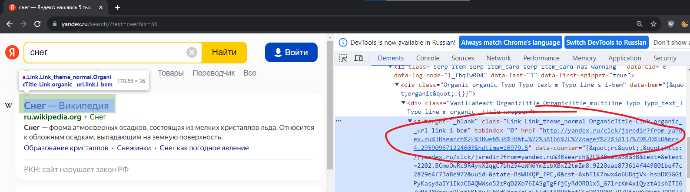
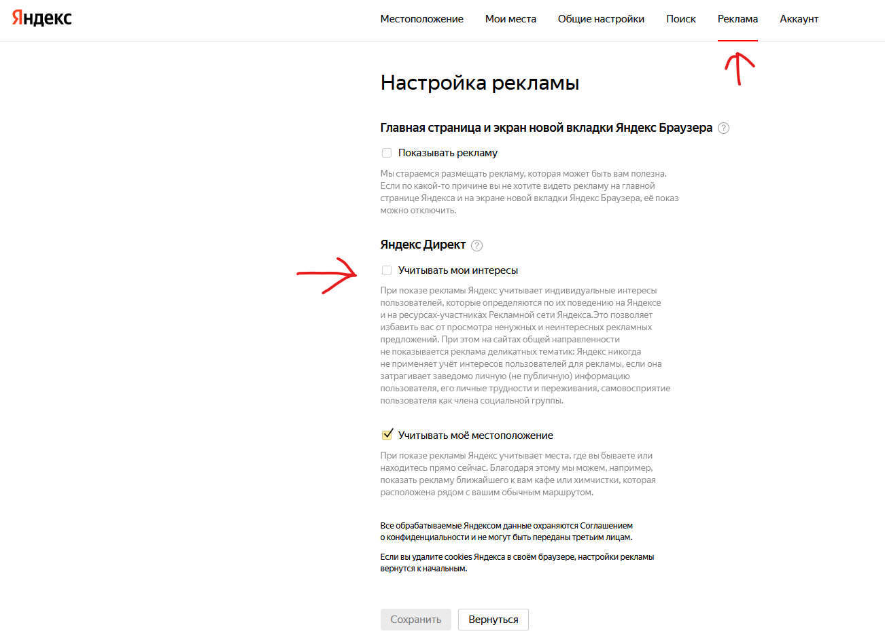

## Проблема: Почему я вижу ya.ru/clck/jsredir?

Вероятно, вы столкнулись с этой проблемой, когда переходите по ссылке на веб-сайт с поисковика Yandex. Вместо ожидаемой страницы вы видите ya.ru/clck/jsredir в адресной строке и ожидаете, когда она загрузится, прежде чем откроется нужный сайт. Это может быть раздражающим и замедлять ваш опыт в сети.

Иногда эта страница загружается долго, и вы теряете ценное время.

## Решение: Как избавиться от перенаправления на ya.ru/clck/jsredir

Следуя этим простым шагам, вы сможете избавиться от назойливого перенаправления на страницу ya.ru/clck/jsredir и ускорить загрузку нужных вам сайтов:

### Шаг 1: Откройте настройки вашего аккаунта на Яндексе

- В правом верхнем углу страницы нажмите на свой аватар.

### Шаг 2: Перейдите в раздел настроек

- В выпадающем меню выберите "Настройки".

### Шаг 3: Измените настройки рекламы

- В меню настроек перейдите на вкладку "Реклама".
- Уберите галочку с настройки "Учитывать мои интересы".

После выполнения этих шагов, перенаправление на страницу ya.ru/clck/jsredir больше не должно мешать вам. Теперь вы сможете быстро загружать нужные вам сайты без лишних задержек.

Мы надеемся, что эта статья помогла вам решить проблему и сделала вашу онлайн-экспертизу более комфортной и эффективной. Наслаждайтесь быстрой загрузкой страниц в вашем браузере!
