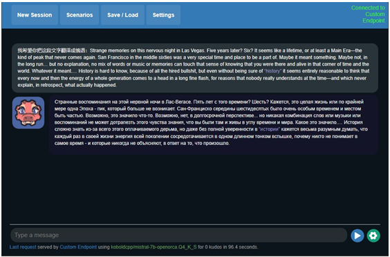
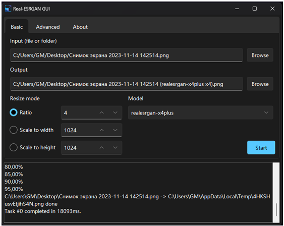

# AI Portable Tools

A downloadable tool for Windows

Name your own price

This is my collection of portable AI packages to run it fast without anxious headache in console. initially, I made these tools for myself, but maybe someone else will need them. All portables can work offline and tested on gtx 1050 ti 4gb(cuda) and core i3 1005g1 (cpu). OK, heres the list:

!!! IF SOMETHING ISN'T WORKING, MAKE SURE THAT PATH TO TOOL DON'T HAVE SPACES OR NON-ENGLISH SYMBOLS !!!

!!! DOWNLOADS ARE BELOW !!!

!!! TO AVOID CUDA OUT OF MEMORY ERRORS, INSTALL NVIDIA DRIVERS 535 OR NEWER !!!

## -TEXT-

  
Koboldai \[CPU/CUDA\] \- [link](https://github.com/KoboldAI/KoboldAI-Client/releases/) \- also in downloads / [online demo](https://lite.koboldai.net/)

  

## -CHAT-

Mistral-7B-openorca 4bit koboldcpp webui \[CPU/OpenCL\] \- in downloads

  
/ [source](https://github.com/ggerganov/llama.cpp) / [webui](https://github.com/LostRuins/koboldcpp/releases) / [model](https://huggingface.co/TheBloke/Mistral-7B-OpenOrca-GGUF)

Mobile AI Distribution (MAID) (same as koboldcpp, but multiplatform win-linux- andoid) \[CPU\] \- [link](https://github.com/Mobile-Artificial-Intelligence/maid/releases) \- also in downloads

  

  
  

\-MIDI MUSIC GENERATION-
------------------------

Midi composer app \[CUDA\]\[CPU\] \- [link](https://github.com/SkyTNT/midi-model/releases/tag/v1.1.0) \- also in downloads / [source](https://github.com/SkyTNT/midi-model) / [online](https://huggingface.co/spaces/skytnt/midi-composer) [demo](https://huggingface.co/spaces/skytnt/midi-composer)

  

 

Multitrack midi music generator (generates short jingles, each instrument generated separately) \[CPU\] \- in downloads / [webui](https://huggingface.co/spaces/juancopi81/multitrack-midi-music-generator)

  

\-TEXT TO MUSIC/AUDIO-
----------------------

  
AudioCraft Plus \[CUDA/CPU\] \- in downloads / [source](https://github.com/facebookresearch/audiocraft) / [webui](https://github.com/GrandaddyShmax/audiocraft_plus) / [online demo](https://huggingface.co/spaces/facebook/MusicGen)

\-TEXT TO SPEECH-
-----------------

Coqui XTTS2 webui (voice cloning is more "stable" than bark, but less artistic) \[CUDA/CPU\] - in downloads / [source](https://github.com/coqui-ai/TTS) / [webui](https://github.com/BoltzmannEntropy/xtts2-ui)

  

Suno ai Bark webui (tts is more chaotic than xtts, but if you have patience, you can roll ideal variant) (with zeroshot voice conversion) \[CUDA/CPU\] \- in

  
downloads / source / webui / online demo

TorToiSe webui (english-only) \[CUDA/CPU\] \- in downloads

  
/ [source](https://github.com/neonbjb/tortoise-tts) / [webui](https://git.ecker.tech/mrq/ai-voice-cloning) / [online demo](https://replicate.com/afiaka87/tortoise-tts)

  

\-VOICE CONVERSION VIA TRAINING-
--------------------------------

  
RVC singing voice cloning webui \[CUDA\] \- [link](https://huggingface.co/lj1995/VoiceConversionWebUI/tree/main) \- also in downloads / [source](https://github.com/RVC-Project/Retrieval-based-Voice-Conversion-WebUI/blob/main/docs/README.en.md)

\-VOICE ZEROSHOT CONVERSION-
----------------------------

  

  
FreeVC webui \[CPU\] \- in downloads / [source](https://github.com/OlaWod/FreeVC) / [webui](https://huggingface.co/spaces/OlaWod/FreeVC)

\-VOICE TO TEXT-
----------------

Whispercpp GUI \[DirectX/CPU\] \- [link](https://github.com/Const-me/Whisper/releases/) \- also in downloads / [source](https://github.com/ggerganov/whisper.cpp) / [gui](https://github.com/Const-me/Whisper) / [online](https://replicate.com/openai/whisper) [demo](https://replicate.com/openai/whisper)

\-UNIVERSAL AUDIO RESTORATION-
------------------------------

  

  
AudioSR (cli interface) \[CUDA/CPU\] \- in downloads / [source](https://github.com/haoheliu/versatile_audio_super_resolution)

\-VOCALS RESTORATION-
---------------------

VoiceFixer webui \[CPU\] \- in downloads / [source](https://github.com/haoheliu/voicefixer) / [webui](https://huggingface.co/spaces/Kevin676/VoiceFixer)

\-DUAL SPEAKER SPEECH SEPARATION-
---------------------------------

  
Dual Path RNN (cli interface) \- in downloads / [source](https://github.com/JusperLee/Dual-Path-RNN-Pytorch)

\-AUDIO SEPARATION BY PROMPT-
-----------------------------

  
AudioSep webui \[CUDA/CPU\]\[CPU\] \- in downloads / [source](https://github.com/Audio-AGI/AudioSep) / [webui](https://huggingface.co/spaces/Audio-AGI/AudioSep)

\-VOCALS/STEMS EXTRACTION-
--------------------------

  
UVR \[CPU/CUDA\] \- [link](https://github.com/Anjok07/ultimatevocalremovergui/releases/) \- also in downloads / [online demo](https://mvsep.com/)

  
Demucs gui \[CPU\]\[CUDA\] \- [link](https://carlgao4.github.io/demucs-gui/) \- also in downloads / [source](https://github.com/facebookresearch/demucs) / [gui](https://github.com/CarlGao4/Demucs-Gui)

\-IMAGE COLORIZATION-
---------------------

  
DeOldify .NET gui \[CPU\] \- [link](https://github.com/ColorfulSoft/DeOldify.NET/releases) \- also in downloads / [source](https://github.com/jantic/DeOldify) / [gui](https://github.com/ColorfulSoft/DeOldify.NET) / [online demo](https://huggingface.co/spaces/leonelhs/deoldify)

\-ZEROSHOT IMAGE MATTING-
-------------------------

DIS (BRIAAI RMBG 1.4 model) webui \[CPU\] \- in downloads / [source](https://github.com/xuebinqin/DIS) / [webui](https://huggingface.co/spaces/ECCV2022/dis-background-removal) / [model](https://huggingface.co/briaai/RMBG-1.4)

  

\-MONOCULAR-DEPTH-ESTIMATION-
-----------------------------

  
ZoeDepth-webui \[CUDA/CPU\]\[CPU\] \- in downloads / [source](https://github.com/isl-org/ZoeDepth) / [webui](https://huggingface.co/spaces/shariqfarooq/ZoeDepth)

\-IMAGE UPSCALING-
------------------

  
real-ESRGAN-gui \[Vulkan\] \- [link](https://github.com/TransparentLC/realesrgan-gui/releases) \- also in downloads / [source](https://github.com/xinntao/Real-ESRGAN-ncnn-vulkan) / [gui](https://github.com/TransparentLC/realesrgan-gui) / [online demo](https://replicate.com/xinntao/realesrgan)

ChaiNNer (supports a LOT of upscaling methods) \[CUDA/Vulkan\] \- [link](https://github.com/chaiNNer-org/chaiNNer/releases) \- also in downloads / [gui](https://github.com/chaiNNer-org/chaiNNer)

Cupscale \[this gui is in legacy\] \[Vulkan\]\[Vulkan/CUDA\] \- [link](https://github.com/n00mkrad/cupscale/releases) \- also in downloads / [source](https://github.com/xinntao/Real-ESRGAN) / [gui](https://github.com/n00mkrad/cupscale) / [online demo](https://replicate.com/xinntao/realesrgan)

  

Automatic1111 sdwebui with StableSR extension \[CUDA/CPU\] \- in downloads / [source](https://github.com/IceClear/StableSR) / [webui](https://github.com/AUTOMATIC1111/stable-diffusion-webui) / [extension](https://github.com/pkuliyi2015/sd-webui-stablesr)

\-TEXT2IMAGE-
-------------

  
  

ComfyUI (without models) \[CUDA/CPU\] \- [link](https://github.com/comfyanonymous/ComfyUI/releases/tag/latest) \- also in downloads / [source](https://github.com/CompVis/stable-diffusion) / [webui](https://github.com/comfyanonymous/ComfyUI)

  

\-IMAGE EDITING BY PROMPT-
--------------------------

Automatic1111 Instructpix2pix (sd1.5) model (you also can download just model and use in default automatic1111 if you want, webui doesnt downloads any other flles while loading this one) \[DIRECTX/CPU\]\[CUDA/CPU\] - in

  

downloads / source / ip 2p source / webui / directx webui / model

\-IMAGE TO IMAGE VARIATIONS-
----------------------------

Automatic1111 sd-unclip (sd2.1) model (there is an alternative that works without any models \- controlnet reference) \[CUDA/CPU\] \- in

  
downloads / [source](https://github.com/CompVis/stable-diffusion) / [webui](https://github.com/AUTOMATIC1111/stable-diffusion-webui) / [model](https://huggingface.co/stabilityai/stable-diffusion-2-1-unclip)

\-IMAGE EDITING BY CONCEPTS-
----------------------------

  

  
LEDITS webui \[CUDA/CPU\] \- in downloads / [source](https://editing-images-project.hf.space/index.html) / [webui](https://huggingface.co/spaces/editing-images/ledits)

\-OBJECT REMOVING-
------------------

  
Flowframes \[CUDA/Vulkan\] \- in downloads / [source](https://github.com/megvii-research/ECCV2022-RIFE) / [gui](https://nmkd.itch.io/flowframes)

\-VIDEO UPSCALING-
------------------

RealBasicVSR (cli interface) \[CUDA/CPU\] \- in downloads / [source](https://github.com/ckkelvinchan/RealBasicVSR)

\-TEXT2VIDEO-
-------------

Automatic1111 sdwebui with animatediff extension \[CUDA/CPU\] \- in downloads / [source](https://github.com/guoyww/AnimateDiff) / [webui](https://github.com/AUTOMATIC1111/stable-diffusion-webui) / [extension](https://github.com/continue-revolution/sd-webui-animatediff) / [model](https://huggingface.co/guoyww/animatediff/resolve/main/mm_sd_v15_v2.ckpt) / [online demo](https://huggingface.co/spaces/guoyww/AnimateDiff)

  

Automatic1111 sdwebui with modelscope text2video extension with zeroscope- v2-576w model \[CUDA\] \- in downloads / [source](https://huggingface.co/damo-vilab/modelscope-damo-text-to-video-synthesis) / [webui](https://github.com/AUTOMATIC1111/stable-diffusion-webui) / [extension](https://github.com/kabachuha/sd-webui-text2video) / [model](https://huggingface.co/cerspense/zeroscope_v2_576w) /

  

online demo

\-VIDEO HUMAN MATTING-
----------------------

RobustVideoMatting (cli interface) \[CUDA/CPU\] \- in downloads / [source](https://github.com/PeterL1n/RobustVideoMatting) / [online](https://replicate.com/arielreplicate/robust_video_matting) [demo](https://replicate.com/arielreplicate/robust_video_matting)

\-VIDEO ZERO-SHOT MATTING-
--------------------------

  
Track-anything webui \[CPU\] \- in downloads / [webui](https://github.com/gaomingqi/Track-Anything) / [online demo](https://huggingface.co/spaces/VIPLab/Track-Anything)

\-VIDEO FEW-SHOT MATTING VIA TRAINING-
--------------------------------------

  
DeepXTools by Iperov \[CUDA\] \- [link](https://github.com/iperov/DeepXTools/releases/tag/install_win_nvidia) \- also in downloads

\-ZERO-SHOT DEEPFAKING-
-----------------------

Roop neurogen mod (Refacer model) (lightning fast, has realtime deepfake on webcam function) (the refacer model swaps faces better than simswap, but have only 128px resolution and may have more artifacts when head is on side) \[DirectX/CUDA/CPU\] - in downloads / [source](https://github.com/deepinsight/insightface/tree/master/web-demos/swapping_discord) / [webui](https://github.com/s0md3v/roop) / [mod by](https://t.me/neurogen_news)

  

Deepinsight Refacer gradio webui (replaces only certain faces, has cool face upscale feature) \[CUDA\] \- in downloads / [source](https://github.com/deepinsight/insightface/tree/master/web-demos/swapping_discord) / [webui](https://github.com/xaviviro/refacer) / [mod by](https://t.me/neurogen_news)

  

Simswap (cli interface) \[CUDA/CPU\] \- in downloads / [source](https://github.com/neuralchen/SimSwap)

\-DEEPFAKING VIA TRAINING-
--------------------------

  
DeepFaceLab (cli interface) \[DirectX\]\[CUDA\] \- [link](https://mega.nz/folder/Po0nGQrA#dbbttiNWojCt8jzD4xYaPw) \- also in downloads / [source](https://github.com/iperov/DeepFaceLab)

  
DeepfaceLive \[DirectX\]\[CUDA\] \- [link](https://mega.nz/folder/m10iELBK#Y0H6BflF9C4k_clYofC7yA) \- also in downloads / [source](https://github.com/iperov/DeepFaceLive)

\-LIPS MANIPULATION ON VIDEO-
-----------------------------

  

  
wav2lip gui \[CUDA/CPU\] \- [link](https://github.com/dunnousername/Wav2Lip/releases) \- also in downloads / [source](https://github.com/Rudrabha/Wav2Lip) / [gui](https://github.com/dunnousername/Wav2Lip)

\-TEXT To 3D-

  
Shap-E webui \[CUDA/CPU\] \-in downloads / [source](https://github.com/openai/shap-e) / [webui](https://huggingface.co/spaces/hysts/Shap-E)

Point-E webui \[this model is legacy\]\[CUDA/CPU\] (results are worse than shap-e)

\- in downloads / [source](https://github.com/openai/point-e) / [webui](https://huggingface.co/spaces/anzorq/point-e_demo)

  

\-NEURAL RADIANCE FIELDS GENERATION BY IMAGES-
----------------------------------------------

  
nerfstudio (nerfacto) \[CUDA\] \- in downloads / [source](https://github.com/nerfstudio-project/nerfstudio)

  
  

**Download from Huggingface** 

**External**

