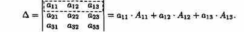
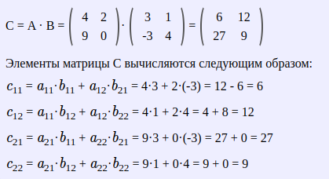

# Билеты для экзамена 1 курс Алгебра

## Билет 1. Определители. Свойства определителей

1) Равноправность строк и столбцов.
Определитель не изменится, если его строки заменить столбцами и наоборот.
2) При перестановке двух параллельных рядов определителя меняется знак
3) Определитель, имеющий два одинаковых ряда равен нулю
4) Общий множитель элементов любого ряда определителя можно вынести за знак
определителя
    - Из свойств 3 и 4 следует, если все элементы некоторого ряда определителя пропорциональны
соответствующим элементов параллельного ряда, то такой определитель равен нулю.
5) Если элементы какого-либо ряда определителя представляют собой суммы двух слагаемых,
то определитель может быть расположен на сумму:
6) Элементарные преобразования определителей.

    - Определитель не изменится если к элементу одного ряда прибавить соответствующие
элементы параллельного ряда, умноженное на любое число.
7) Разложение определителя по элементам некоторого ряда.
    - Определитель равен сумме произведений элементов некоторого ряда на соответствующие им
алгебраические дополнения.

8) Сумма произведений элементов какого-либо ряда определителя на алгебраические
дополнения соответствующих элементов параллельного ряда равна нулю.

## Билет 2. Вычисление определителей

## Билет 3. Матрицы. Понятие числовой матрицы. Специальные виды матриц

- Матрицей (числовой матрицей) называется прямоугольная таблица элементов, содержащие М строк одинаковые длины или n столбцов.

- Матрица из m строк и n столбцов называется матрицей размера m*n.
- Матрицы равны между собой, если они имеют одинаковые размеры и их соответствующие элементы равны.
- Квадратная матрица - число строк=число столбцов
- Квадратная матрица n-го порядка обозн. N*n элементов
- Главная диагональ - элементы из левого верхнего в правый нижний угол
- Симметричная матрица - элементы относительно главной диагонали равны.
- Диагональная матрица - квадратная матрица, все элементы которой кроме элементов главной диагонали равны нулю.
- Единичная матрица - диагональная матрица с единицами по главной диагонали.
- Треугольная матрица - квадратная, если все её элементы, расположенные по одну сторону от главной диагонали равны нулю.
- Нулевая матрица - все элементы равны нулю.
- Вектор - матрица из одного столбца или из одной строки.
- Матрица размера 1*1 состоящая из одного элемента, отождествляется с этим элементов.
- Транспонированная матрица - матрица A T , полученная из исходной матрицы A заменой строк на столбцы.

## Билет 4. Действия над матрицами (Операции над матрицами)

- Сложение - каждый элемент складывается с элементом второй матрицы

        Свойства операции сложения:
        1. A + B = B + A – переместительный закон.
        2. (A + B)+ C = A + (B + C) – сочетательный закон.
        3. Нуль-матрица при сложении матриц выполняет роль обычного нуля при сложении чисел: 
            A+O=A.

- Вычитание - аналогично
- Умножение матрицы на число

- Произведение матриц

    Операция умножения матриц (двух) только для случаев когда число столбцов 1-й матрицы равно числу строк 2-й матрицы

    Свойства операции умножения матриц.
    1. A B ≠ B A .
    2. A (B C)= (A B) C – сочетательный закон.
    3. (A + B) C = A C + B C – распределительный закон относительно сложения.
    4. При умножении любой квадратной матрицы A на единичную матрицу того же порядка E снова получится матрица A:
    AE=E A=A.

## Билет 5. Элементарные преобразования матриц

- Перестановка местами двух параллельныъ рядов матрицы
- Умножение всех элементов ряда матрицы на число, отлично от нуля
- Прибавление ко всем элементам ряда матрицы соответствующих элементов параллельного ряда, умноженного на одно и то же число.

### Эквивалентные А~В

Две матрицы А и В эквивалентные, если одна из них получается из другой с помощью элементарных преобразвоаний.

### Каноническая матрица

С помощью элементарных преобразваний любую матрицу можно привести к матрице, у которой в начале главной диагонали стоят подряд несколько единиц, а все остальные элементы равны нулю.

## Билет 6. Обратная матрица

Квадратная матрица А называется обратной матрице А, если выполняется условие

$$ A^{-1}\cdot A=A \cdot A^{-1}=E $$

где E - единичная матрица такого же ряда как и матрица А.

- Невырожденная мартрица - определитель ≠ 0
- Вырожденная матрица - определитель = 0

$$Матрица\  A^{-1}\ имеет\ те\ же\ размеры,\ что\ и\ матрица\  A $$

### Теорема

Всякая невырожденная матрица имеет обратную

### Союзная матрица

Матрицей, союзной к матрице А называется матрица
$$ A^{\ast }=\begin{bmatrix} A_{11} & A_{21} & A_{n1} \\ A_{12} & A_{22} & A_{n2} \\ A_{1n} & A_{2n} & A_{nn}\end{bmatrix} $$

$$ где\  A_{ij} - алгебраическое\ дополнение\ элемента\ a_{ij}\ данной\  матрицы\ А$$
