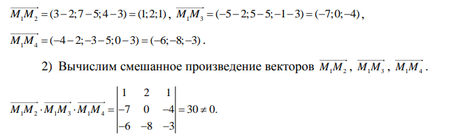

# Скачать docx-версию

[Скачать algebra.docx](algebra.docx)

# Билеты для экзамена 1 курс Алгебра

# Определители

## Билет 1. Определители. Свойства определителей

1) Равноправность строк и столбцов.
Определитель не изменится, если его строки заменить столбцами и наоборот.
2) При перестановке двух параллельных рядов определителя меняется знак
3) Определитель, имеющий два одинаковых ряда равен нулю
4) Общий множитель элементов любого ряда определителя можно вынести за знак
определителя
    - Из свойств 3 и 4 следует, если все элементы некоторого ряда определителя пропорциональны
соответствующим элементов параллельного ряда, то такой определитель равен нулю.
5) Если элементы какого-либо ряда определителя представляют собой суммы двух слагаемых,
то определитель может быть расположен на сумму:
6) Элементарные преобразования определителей.

    - Определитель не изменится если к элементу одного ряда прибавить соответствующие
элементы параллельного ряда, умноженное на любое число.
7) Разложение определителя по элементам некоторого ряда.
    - Определитель равен сумме произведений элементов некоторого ряда на соответствующие им
алгебраические дополнения.

8) Сумма произведений элементов какого-либо ряда определителя на алгебраические
дополнения соответствующих элементов параллельного ряда равна нулю.

## Билет 2. Вычисление определителей

### Вычисление определителей

Определитель матрицы — это численная характеристика, которая приписывается квадратной матрице. Для матрицы  $$ A $$ порядка $$ n $$ определитель обозначается как $$ \text{det}(A) $$ или $$ |A| $$. Рассмотрим основные методы вычисления определителя.

#### 1. **Метод разложения по строке (столбцу)**
Для матрицы $$ A = [a_{ij}]_{n \times n} $$ определитель можно выразить через миноры:

$$ \text{det}(A) = \sum_{i=1}^{n} (-1)^{i+j} \cdot a_{ij} \cdot \text{det}(M_{ij}) $$

где $$ M_{ij} $$ — это минор матрицы $$ A $$, полученный вычеркиванием  i -й строки и  j-го столбца.

#### 2. **Метод треугольной матрицы**
Если матрица  A  приводится к верхнетреугольному виду, то определитель равен произведению элементов главной диагонали:

$$ \text{det}(A) = \prod_{i=1}^{n} a_{ii} $$

#### Пример

Рассмотрим матрицу:

$$ A = \begin{bmatrix} 3 & 1 & 4 \\ 1 & 5 & 9 \\ 2 & 6 & 5 \end{bmatrix} $$

1. **Метод разложения по строке (столбцу)**

   Выберем, например, первую строку. Разложим определитель по этой строке:

$$ \text{det}(A) = 3 \cdot \text{det}\left(\begin{bmatrix} 5 & 9 \\ 6 & 5 \end{bmatrix}\right) - 1 \cdot \text{det}\left(\begin{bmatrix} 1 & 9 \\ 2 & 5 \end{bmatrix}\right) + 4 \cdot \text{det}\left(\begin{bmatrix} 1 & 5 \\ 2 & 6 \end{bmatrix}\right) $$

2. **Метод треугольной матрицы**

   Приведем матрицу \( A \) к верхнетреугольному виду:

$$ A = \begin{bmatrix} 3 & 1 & 4 \\ 0 & 4 & 8 \\ 0 & 2 & -3 \end{bmatrix} $$

   Теперь определитель равен произведению элементов главной диагонали: 
   
$$ \text{det}(A) = 3 \cdot 4 \cdot (-3) = -36 $$

Таким образом, определитель матрицы \( A \) равен -36.

# Матрицы

## Билет 3. Матрицы. Понятие числовой матрицы. Специальные виды матриц

- Матрицей (числовой матрицей) называется прямоугольная таблица элементов, содержащие М строк одинаковые длины или n столбцов.

- Матрица из m строк и n столбцов называется матрицей размера m*n.
- Матрицы равны между собой, если они имеют одинаковые размеры и их соответствующие элементы равны.
- Квадратная матрица - число строк=число столбцов
- Квадратная матрица n-го порядка обозн. N*n элементов
- Главная диагональ - элементы из левого верхнего в правый нижний угол
- Симметричная матрица - элементы относительно главной диагонали равны.
- Диагональная матрица - квадратная матрица, все элементы которой кроме элементов главной диагонали равны нулю.
- Единичная матрица - диагональная матрица с единицами по главной диагонали.
- Треугольная матрица - квадратная, если все её элементы, расположенные по одну сторону от главной диагонали равны нулю.
- Нулевая матрица - все элементы равны нулю.
- Вектор - матрица из одного столбца или из одной строки.
- Матрица размера 1*1 состоящая из одного элемента, отождествляется с этим элементов.
- Транспонированная матрица - матрица A T , полученная из исходной матрицы A заменой строк на столбцы.

## Билет 4. Действия над матрицами (Операции над матрицами)

- Сложение - каждый элемент складывается с элементом второй матрицы

        Свойства операции сложения:
        1. A + B = B + A – переместительный закон.
        2. (A + B)+ C = A + (B + C) – сочетательный закон.
        3. Нуль-матрица при сложении матриц выполняет роль обычного нуля при сложении чисел: 
            A+O=A.

- Вычитание - аналогично
- Умножение матрицы на число

- Произведение матриц

    Операция умножения матриц (двух) только для случаев когда число столбцов 1-й матрицы равно числу строк 2-й матрицы

    Свойства операции умножения матриц.
    1. A B ≠ B A .
    2. A (B C)= (A B) C – сочетательный закон.
    3. (A + B) C = A C + B C – распределительный закон относительно сложения.
    4. При умножении любой квадратной матрицы A на единичную матрицу того же порядка E снова получится матрица A:
    AE=E A=A.

## Билет 5. Элементарные преобразования матриц

- Перестановка местами двух параллельныъ рядов матрицы
- Умножение всех элементов ряда матрицы на число, отлично от нуля
- Прибавление ко всем элементам ряда матрицы соответствующих элементов параллельного ряда, умноженного на одно и то же число.

### Эквивалентные А~В

Две матрицы А и В эквивалентные, если одна из них получается из другой с помощью элементарных преобразвоаний.

### Каноническая матрица

С помощью элементарных преобразваний любую матрицу можно привести к матрице, у которой в начале главной диагонали стоят подряд несколько единиц, а все остальные элементы равны нулю.

## Билет 6. Обратная матрица

Квадратная матрица А называется обратной матрице А, если выполняется условие

$$ A^{-1}\cdot A=A \cdot A^{-1}=E $$

где E - единичная матрица такого же ряда как и матрица А.

- Невырожденная мартрица - определитель ≠ 0
- Вырожденная матрица - определитель = 0

$$Матрица\  A^{-1}\ имеет\ те\ же\ размеры,\ что\ и\ матрица\  A $$

### Теорема

Всякая невырожденная матрица имеет обратную

### Союзная матрица

Матрицей, союзной к матрице А называется матрица
$$ A^{\ast }=\begin{bmatrix} A_{11} & A_{21} & A_{n1} \\\\ A_{12} & A_{22} & A_{n2} \\ \\A_{1n} & A_{2n} & A_{nn}\end{bmatrix} $$

$$ где\  A_{ij} - алгебраическое\ дополнение\ элемента\ a_{ij}\ данной\  матрицы\ А$$

### Вычисление обратной матрицы

$$ A^{-1}=\dfrac{A^{\ast }}{\Delta } $$

### Свойства обратной матрицы

## Билет 7. Ранг матрицы

Рассмотрим матрицу А размера m*n

Выделим в ней k строк и k столбцов k ⩽ min (m:m)

Из элеметов, стоящих на пересечении выделенных строк и столбцов, составим определитель k-ого порядка

Все таким определители - миноры этой матрицы.

Наибольший из порядка минор данной матрицы, отличной от нуля, называется рангом матрицы.

Обознач r или r(A) или rang A

Базисным минором матрицы называется любой её ненулевой минор максимального порядка.

У матрицы может быть несколько базисных миноров

### Свойства ранга матрицы

1) Ранг матрицы не меняется при транспонировании

2) Если вычеркнуть из матрицы ненулевой ряд, то ранг матрицы не изменится

3) Ранг матрицы не меняется при элементарных преобразованиях матрицы

Ранг канонической матрицы равен числу единицы по главной диагонали

### Элементарными преобразованиями для матрицы A

1. Перестановка строк или столбцов местами.

2. Умножение строки или столбца на ненулевой коэффициент.

3. Прибавление к одной строке или столбцу матрицы другой её строки или столбца, умноженной на некоторое число k.

4. Зачёркивание нулевой строки или столбца матрицы.

# СЛАУ

## Билет 8. Системы линейных алгебраических уравнений, их виды и формы их записи. Критерий Кронекера-Капелли совместимости СЛАУ

СЛАУ, содержащее m уравнений и m неизвестных называется системой вида

$$ \begin{cases}
a_{11}x_{1}+a_{12}x_{2}+...+a_{1n}x_{n}=b_{1},\\\\
a_{21}x_{1}+a_{22}x_{2}+...+a_{2n}x_{n}=b_{2},\\\\
.............................................,\\\\
a_{31}x_{1}+a_{32}x_{2}+...+a_{3n}x_{n}=b_{3},\\\\
\end{cases}$$

$$где\ числа\ a_{ij} (i=\overline{1,m} j=\overline{1,n}) - координаты\ системы$$

$$ b_{i} - свободные\ члены$$
$$ x_{1, 2, 3, ..., n} - неизвестные\ члены$$

В матричной форме такая система записывается так:
$$ AX=B$$
где

$$
A=\begin{pmatrix}
a_{11}, & a_{12}, & a_{1n} \\\\
... & ... & a_{mm} \\\\
\end{pmatrix}
$$

#### Вектор столбце неизвестных

$$
X=\begin{pmatrix}
x_{1}\\\\
x_{2}\\\\
x_{3}\\\\
\end{pmatrix}
$$

#### Матрица-столбец свободных членов

$$
B=\begin{pmatrix}
b_{1}\\\\
b_{2}\\\\
b_{3}\\\\
\end{pmatrix}
$$

### Расширенная матрица СЛАУ

Составленная из основной матрицы и дополненная столбцами свободных членов

$$
\overline{A}=\begin{pmatrix}
a_{11}, & a_{12}, & a_{1n} & b_{1} \\\\
... & ... & ... & ...\\\\
a_{m1}, & a_{m2}, & a_{mn} & b_{n} \\\\
\end{pmatrix}
$$

### Решение СЛАУ

Решением СЛАУ называется n значений неивестных x1=c1, x2=c2, xn=cn
при подстановке которых все уравнения систем обращаются в вершины равенства.

Всякое решение СЛАУ можно записать в виде матрицы столбца:

$$
C=\begin{pmatrix}
c_{1}\\\\
c_{2}\\\\
c_{3}\\\\
\end{pmatrix}
$$

### Совместная СЛАУ

СЛАУ называется совместной, если она имеет хотя бы одно решение, и

### Несовместная СЛАУ

СЛАУ называется несовместной, если она не имеет ни одного решения

### Совместная определенная СЛАУ

Совместная определенная СЛАУ имеет единственное решение

### Совместная неопределенная СЛАУ

Совместная неопределенная СЛАУ имеет больше 1 решения. Здесь каждое её решение называется частным решением системы

### Общее решение СЛАУ

Совокупность всех частных решений

### Решить СЛАУ

Решить СЛАУ - значит выяснить, совместна она или нет, а если совместа, то найти её общее решение

### Эквивалентность СЛАУ

Две СЛАУ называются эквивалентные (равносильными), если они имеют одно и то же общее решение

Эквивалентные СЛАУ получаются в частности, при элементарных преобразованиях системы при условии, что преобразования выполняются лишь над строками матрицы

### Однородная СЛАУ

СЛАУ называется однородной, если все её свободные члены равны нулю

$$ \begin{cases}
a_{11}x_{1}+a_{12}x_{2}+...+a_{1n}x_{n}=0,\\\\
a_{21}x_{1}+a_{22}x_{2}+...+a_{2n}x_{n}=0,\\\\
.............................................,\\\\
a_{m1}x_{1}+a_{m2}x_{2}+...+a_{mn}x_{n}=0,\\\\
\end{cases}$$

Однородные СЛАУ всегда совместны, так как
$$
x_{1} = x_{2} = ... = x_{n}=0
$$

является решением системы. Это решение называется нулевым (тривиальным).

### Теорема ронекера-Капелли

СЛАУ совместина тогда и только тогда, когда ранг расширенной матрицы равен рангу основной матрицы.

$$ r\left( A\right) =r\left( B\right) $$

Правила практического рахождения всех решений совместных систем вытекают из следующих теорем:

### Теорима 1

Если ранг совместных СЛАУ равен числу неивестных, то система имеет единственное значение

### Теорема 2

Если ранг совместных СЛАУ меньше числа неизвестных, то система имеет бесконечное множество решений

## Билет 9. Техника решения система линейных уравнений. Матричный способ

Пусть дана система СЛАУ с n неизвестными

$$ \begin{cases}
a_{11}x_{1}+a_{12}x_{2}+...+a_{1n}x_{n}=b_{1},\\\\
a_{21}x_{1}+a_{22}x_{2}+...+a_{2n}x_{n}=b_{1},\\\\
.............................................,\\\\
a_{m1}x_{1}+a_{m2}x_{2}+...+a_{mn}x_{n}=b_{1},\\\\
\end{cases}$$

### Запишем её в матричной форме

$$
\overline{A}=\begin{pmatrix}
a_{11}, & a_{12}, & a_{1n} \\\\
a_{21}, & a_{22}, & a_{2n} \\\\
a_{n1}, & a_{n2}, & a_{nn} \\\\
\end{pmatrix}
$$

### Определитель этой матрицы называтеся определителем системы:

$$
\Delta =\begin{vmatrix}
a_{11}, & a_{12}, & a_{1n} \\\\
a_{21}, & a_{22}, & a_{2n} \\\\
a_{n1}, & a_{n2}, & a_{nn} \\\\
\end{vmatrix}
$$

#### Невырожденная СЛАУ

$$ Если\ \Delta ≠ 0 , то\ СЛАУ\ называется\ невырожденной$$

$$  Найдем\ решение\ СЛАУ\ когда\ \Delta ≠ 0 $$

Если система невырождена - применяем формулу

$$ X=A^{-1} \cdot B  $$

$$ A^{-1} \cdot A = E  $$

$$ E \cdot X = X  $$

### Найдем обратную матрицу

$$
A_{ij}=\left( -1\right) ^{i+j}\cdot M_{ij} \\\\
M_{ij}= минор
$$

### Составим союзную матрицу

$$
A^*=\begin{pmatrix}
A_{11}, & A_{21}, & A_{31} \\\\
A_{12}, & A_{22}, & A_{32} \\\\
A_{13}, & A_{23}, & A_{33} \\\\
\end{pmatrix}
$$

### Найдем обратную матрицу

$$ A^{-1}=\dfrac{A^{\ast }}{\Delta }= \dfrac{1}{\Delta } \cdot A^{\ast }$$

### Подставим матрицу А^1 и В в формулу

$$ X=A^{-1} \cdot B  $$

### Ответ

Таким образом
$$ x_{1}=c_{1},  x_{2}=c_{2}, x_{2}=c_{2},  $$

## Билет 10. Техника решения система линейных уравнений. Формулы Крамера.

Пусть дана система СЛАУ с n неизвестными

$$ \begin{cases}
a_{11}x_{1}+a_{12}x_{2}+...+a_{1n}x_{n}=b_{1},\\\\
a_{21}x_{1}+a_{22}x_{2}+...+a_{2n}x_{n}=b_{2},\\\\
.............................................,\\\\
a_{m1}x_{1}+a_{m2}x_{2}+...+a_{mn}x_{n}=b_{n},\\\\
\end{cases}$$

невырожденная система линейных алгебраических уравнений с n неизвестными
$$ \Delta ≠ 0 $$
имеет единственное решение, которое может быть найдено по формуле Крамера:

### Формула Крамера

$$ x_{i}=\dfrac{\Delta_{i}}{\Delta }$$

Определитель $$\Delta_{i}$$
получается из определителя системы $$\Delta$$
путем замены i-го столбца коэффициентов столбцов из вободных членов.

Для 1

$$
\Delta =\begin{vmatrix}
b_{1} & a_{12} & a_{13} \\\\
b_{2} & a_{22} & a_{23} \\\\
b_{3} & a_{32} & a_{33} \\\\
\end{vmatrix}
$$

Для 2

$$
\Delta =\begin{vmatrix}
a_{11} & b_{1} & a_{13} \\\\
a_{21} & b_{2} & a_{23} \\\\
a_{31} & b_{3} & a_{33} \\\\
\end{vmatrix}
$$

Для 3

$$
\Delta =\begin{vmatrix}
a_{11},  & a_{12},   & b_{1} \\\\
a_{21},  & a_{22},  & b_{2} \\\\
a_{31},  & a_{32},  & b_{3} \\\\
\end{vmatrix}
$$

## Билет 11. Техника решения система линейных уравнений. Метод Гаусса. Общее решение СЛАУ

Метод Гаусса являетсяодним из универсальных и эффективных методов решения СЛАУ.

Этот метод состоит из последовательного исключения неизвестных.

В отличии от матричного способа и применения формул Крамера, метод Гаусса может быть применен в СЛАУ с произвольным числом и счислении.

Процесс решения по методу Гаусса состоит из 2-х этапов.

### 1 этап - прямой ход

СЛАУ приводится к ступенчатому виду. Через элементарные преобразования.

### 2 этап - обратных ход

Идет последовательность неизвестных по этой ступенчатой матрице.

Если ступенчатая СЛАУ оказывается треугольной, то исходная система имеет единственное решение.

Из первого уравнения находят x_n, из предпоследнего x_n-1, далее поднимается по течению вверх, вычисляя все остальные неизвестные.

На практике удобнее работать не с самой СЛАУ, а с её расширенной матрицей, выполняя все преобразования.

Предпочтительнее, чтобы коэффециет a_11 равнялся единице.

## Билет 12. Системы линейных однородных уравнений

Линейное уравнение называется однородным, если свободный член в этом уравнении равен нулю.

Система n линейных однородных уравнений с n неизвестными имеет вид:

$$ \begin{cases}
a_{11}x_{1}+a_{12}x_{2}+...+a_{1n}x_{n}=0,\\\\
a_{21}x_{1}+a_{22}x_{2}+...+a_{2n}x_{n}=0,\\\\
.............................................,\\\\
a_{m1}x_{1}+a_{m2}x_{2}+...+a_{mn}x_{n}=0,\\\\
\end{cases}$$

Такая система всегда совместна, так как при любых коэффициентах aik имеет очевидное решение: x1 = 0, x2 = 0,..., xn = 0. Это решение называется нулевым (тривиальным) решением.

Если среди чисел, составляющих решение системы (1.43), имеется хотя бы одно, отличное от нуля, то такое решение называется ненулевым.

### Однородная слау имеет ненулевую длину

#### Теорема 1

Для того, чтобы система однородных алгебраических уравнений имеет одно решение необходимо и достаточно собирать основную матричную систему

#### Теорема 2

##### Теорема 2.1

Для того, чтобы однородная система n линейных уравнений с n неизвестными имела ненулевые решения, необходимо и достаточно, чтобы её определитель ∆ был равен нулю, т.е. ∆ = 0

##### Теорема 2.2

Для того, чтобы однородная система из m линейных уравнений с n
неизвестными имела ненулевое решение необходимо и достаточно, чтобы ранг r ее основной матрицы был меньше числа n неизвестных, т.е. r < n .

Из теоремы следует, что в случае квадратной матрицы A будем иметь:

1) если det  A ≠ 0, то система имеет единственное нулевое решение;
2) если det  A = 0, то система имеет бесконечно много решений.

# Векторы

## Билет 13. Векторы. Линейные операции над векторами

### Скалярная величина
Полностью определяется целочисленным значениям - площадь, объем длина, температура

### Векторные величины

Значение + направеление

### Вектор - направленный отрезок, имеющий длину и направление

### Протиповоложный вектор

$$ \overrightarrow{BA}=-\overrightarrow{AB} = - \overrightarrow{a} $$

### Длина или модуль вектора

Длина или модуль вектора AB называется длина отрезка AB.

$$обознач.\ \left| \overrightarrow{BA}\right| $$

### Нулевой вектор

Вектор, длина которого равна нулю, называется нулевым

$$обознач.\ \overrightarrow{0} $$

### Единичный вектор
Вектор, длина которого равна единице, называется единичным вектором

$$обознач.\ \overrightarrow{e} $$

### Орта вектора

Единичный вектор, направление которого совпадает с направлением вектора

$$\overrightarrow{a} $$

называется ортом вектора

$$\overrightarrow{a} $$

обозначается

$$ \overrightarrow{a}^{0} $$

### Угол между векторами

Углом ϕ между векторами a и b называют угол между их направлениями

### Компланарные векторы - параллельные  одной плоскости

Векторы a и b компланарны, если они лежат на одной прямой, либо на параллельных прямых

### Коллинеарные векторы - параллельные одной прямой

#### Общее обозначение

$$ \overrightarrow{a}\ || \overrightarrow{b} $$

#### Одинаковонаправленные (сонаправлены) векторы

#### Противонаправленные векторы

### Равные векторы

1) Имеют одинаковую длину
2) Коллинеарны
3) Сонаправлены

### Свободные векторы

Можно отложить от любой точки

### Линейные операции над векторами

#### Сложение векторов

1) Правило треугольника

2. Правило параллелограмма

#### Вычитание векторов
$$ Под\ разностью\ векторов\ ~a\ и\ ~b\ понимается\ вектор\ ~c = ~a − ~b\ такой,\ что\ ~c = ~a + (−~b). $$

#### Умножение вектора на число (скаляр)

Произведением вектора a на скаляр (число) λ называется
вектор c = λa, удовлетворяющий следующим условиям

1) он имеет длину |c| = |λ| * |a|;
2) его направление совпадает с направление вектора a, если λ > 0 и противоположно вектору a, если λ < 0

Свойства линейных операций над векторами:

1. $$ \vec{a} + \vec{b} = \vec{b} + \vec{a} $$
2. $$ (\vec{a} + \vec{b}) + \vec{c} = \vec{a} + (\vec{b} + \vec{c}) $$
3. $$ \lambda_{1} \cdot (\lambda_{2} \vec{a}) = (\lambda_{1} \cdot \lambda_{2}) \vec{a} $$
4. $$ (\lambda_{1} + \lambda_{2}) \vec{a} = \lambda_{1} \vec{a} + \lambda_{2} \vec{a} $$
5. $$ \lambda \cdot (\vec{a} + \vec{b}) = \lambda \vec{a} + \lambda \vec{b} $$
6. $$ \vec{a} + \overrightarrow{0} = \vec{a} $$
7. $$ Для\ любого\ вектора\ \vec{a}\  существует\ вектор\  -\vec{a} ,\ такой\ что\  \vec{a} + (-\vec{a}) = \overrightarrow{0} $$

## Билет 14. Проекция вектора на ось. Разложение вектора по ортам координатных осей. Модуль вектора.

Пусть в пространстве задана ось L, т.е. направленная прямая.

### Ортогональная проекция точки на ось

Проекция точки M на ось L называется основание M1 с перпендикуляром MN1, опущенного на ось.

Точка M1 есть точка пересечения оси l с плоскостью, проходящей
через точку M перпендикулярно оси.

### Ортогональная проекция вектора на ось

Проекция $$ \vec{a} $$  на ось l равна произведению $$ |\vec{a}| $$  на косинус угла между вектором и осью

### Основные свойства проекций

1) Проекция вектора на ось положительна (отрицательна), если
вектор образует с осью острый (тупой) угол, и равна нулю, если этот
угол – прямой.

2) Проекции равных векторов на одну и ту же ось равны между
собой

2. Проекция суммы векторов на одну и ту же ось равна сумме их
проекций на эту ось

3. При умножении вектора ~a на число λ его проекция также умножается на это число:

$$ ПР_{l}\left( \lambda \cdot \overrightarrow{a}\right) =\lambda \cdot ПР_{i}\overrightarrow{a} $$

Линейные операции над векторами приводят к линейным операциям над проекциями этих векторов.

### Разложение вектора по ортам координатных осей

Рассмотрим в пространстве прямоугольную систему координат **Oxyz**

Выделим на координатных осях Ox, Oy, Oz единичные векторы (орты), обозначаемые соответственно

$$ \overrightarrow{i}, \overrightarrow{j},\overrightarrow{k}$$

Рассмотрим вектор

$$ \overrightarrow{a} = \overrightarrow{OM}$$

и совместим его с началом координат О.

#### Найдем проекцию вектора на координатные оси

Для этого проведем через конец вектора

$$\overrightarrow{OM}$$

плоскость, параллельно координатным плоскостям.

Точки пересечения этих плоскостей с осями координат обозначаются соответственно

$$ M_{1}, M_{2}, M_{3},  $$

Получим прямоугольный параллелепипед одной из диагоналей которого является вектор

$$\overrightarrow{OM}$$

##### Проекции вектора на координатные оси

$$ ПР_{x}\overrightarrow{a} = |\overrightarrow{OM_{1}}|  $$

$$ ПР_{y}\overrightarrow{a} = |\overrightarrow{OM_{2}}|  $$

$$ ПР_{z}\overrightarrow{a} = |\overrightarrow{OM_{3}}|  $$

##### По определению суммы нескольких векторов

$$ \overrightarrow{OM} = OM_{1} + OM_{2} + OM_{3}  $$

или

$$ \overrightarrow{OM} = OM_{1} + M_{1}N + NM  $$

т.к.

$$ M_{1}N = OM_{2} $$

$$ NM = OM_{3} $$

##### По определению проекции вектора имеем

$$ \overrightarrow{OM_{1}} = |\overrightarrow{OM_{1}}| \cdot \overrightarrow{i} $$

$$ \overrightarrow{OM_{2}} = |\overrightarrow{OM_{2}}| \cdot \overrightarrow{j} $$

$$ \overrightarrow{OM_{3}} = |\overrightarrow{OM_{3}}| \cdot \overrightarrow{k} $$

##### Обозначим проекцию вектора на оси

Обозначим проекцию вектора на оси Ox, Oy, Oz. Тогда

$$ |\overrightarrow{OM_{1}}| = a_{x} $$

$$ |\overrightarrow{OM_{2}}| = a_{y} $$

$$ |\overrightarrow{OM_{3}}| = a_{z} $$

Отсюда

$$ \overrightarrow{OM_{1}} = a_{x} \cdot \overrightarrow{i} $$

$$ \overrightarrow{OM_{2}} = a_{y} \cdot \overrightarrow{j} $$

$$ \overrightarrow{OM_{3}} = a_{z} \cdot \overrightarrow{k} $$

Подставляя выражения для

$$ \overrightarrow{OM_{1}}, \overrightarrow{OM_{2}}, \overrightarrow{OM_{3}}, $$

в равенство, получим

##### Формулу разложения вектора по ортам координатных осей

$$ \overrightarrow{a} = \overrightarrow{OM_{1}} = a_{x} \cdot \overrightarrow{i} + a_{y} \cdot \overrightarrow{j} + a_{z} \cdot \overrightarrow{k}$$

### Модуль вектора

#### Теорема о длине диагонали прямоугольного параллелепипеда

$$ |\overrightarrow{OM}|^2 = |\overrightarrow{OM_{1}}|^2 + |\overrightarrow{OM_{2}}|^2 + |\overrightarrow{OM_{3}}|^2$$

или

$$ |\overrightarrow{a}|^2 = \overrightarrow{a_{x}}^2 + \overrightarrow{a_{y}}^2 + \overrightarrow{a_{x}}^2$$

отсюда

$$ |\overrightarrow{a}| = \sqrt{\overrightarrow{a_{x}}^2 + \overrightarrow{a_{y}}^2 + \overrightarrow{a_{x}}^2}$$

Модуль вектора равен квадратному корню сумы его проекции.

Пусть углы, образованные вектором a с осями координат Ox, Oy, Oz соответственно равны

$$ \alpha, \beta, \gamma $$

#### Тогда по свойству проекции вектора на ось получим

$$ a_{x} = | \overrightarrow{a}| \cdot \alpha $$

$$ a_{y} = | \overrightarrow{a}| \cdot \beta $$

$$ a_{z} = | \overrightarrow{a}| \cdot \gamma $$

#### Направляющие косинусы вектора

$$ \cos{\alpha} = \frac{a_{x}}{|\overrightarrow{a}|} $$

$$ \cos{\beta} = \frac{a_{y}}{|\overrightarrow{a}|} $$

$$ \cos{\gamma} = \frac{a_{z}}{|\overrightarrow{a}|} $$

#### Сумма квадратов неправляющих косинусов ненулевого вектора равна 1

$$ cos^2{\alpha} + cos^2{\beta} + cos^2{\gamma} = 1 $$

## Билет 14.2. Координаты вектора

$$ A_{1} (x_{1}; y_{1}; z_{1}) $$

$$ A_{2} (x_{2}; y_{2}; z_{2}) $$

$$ \overrightarrow{A_{1}A_{2}} = (x_{2} - x_{1}; y_{2} - y_{1}; z_{2} - z_{1}) $$

## Билет 15. Произведения векторов. Скалярное произведение

Скалярное произведение ненулевых векторов А и В называется число, равное, произведению длин этих векторов на косинус угла между ними

$$ \overrightarrow{a} \cdot \overrightarrow{b} = |\overrightarrow{a}| \cdot |\overrightarrow{b} | \cdot cos{\phi} $$

#### Свойства скалярного произведения

1) Переместительное свойство

$$ \overrightarrow{a} \cdot \overrightarrow{b} = \overrightarrow{b} \cdot \overrightarrow{a} $$

2) Сочетательное свойство

$$ (\lambda \overrightarrow{a}) \cdot \overrightarrow{b} = \lambda (\overrightarrow{b} \cdot \overrightarrow{a}) $$

$$ \lambda - некоторое\ число $$

3) Распределительное свойство

$$ a (\overrightarrow{b} \cdot \overrightarrow{c}) = a\overrightarrow{b} + a\overrightarrow{c} $$

4) Скалярный квадрат вектора равен длине вектора в квадрате

$$ \overrightarrow{a} = |\overrightarrow{a}|^2 $$

5) Если ненулевые векторы A и B взаимно перпендикулярны, то их скалярное произведение равно нулю.

### Скалярное произведение по координатам

$$ \overrightarrow{a} (a_{x}; a_{y}; a_{z}) $$

$$ \overrightarrow{b} (b_{x}; b_{y}; b_{z}) $$

$$ \overrightarrow{a} \cdot \overrightarrow{b} = (a_{x}b_{x} + a_{y}b_{y} + a_{z}b_{z}) $$

### Приложения скалярного произведения

1) Длина вектора

$$ \overrightarrow{a} = \sqrt{\overrightarrow{a} \cdot \overrightarrow{a}} = \sqrt{a_{x}^2 + a_{y}^2 + a_{z}^2}$$

2) Расстояние между двумя точками

$$ |\overrightarrow{AB}| = \sqrt{(x_{2} - x_{1})^2 + (y_{2} - y_{1})^2 + (z_{2} - z_{1})^2} $$

3) Косинус угла между векторами

$$ cos \phi = \frac{\overrightarrow{a}\overrightarrow{b}}{|\overrightarrow{a}||\overrightarrow{b}|} = \frac{a_{x}b_{x} + a_{y}b_{y} + a_{z}b_{z}}{\sqrt{a_{x}^2 + a_{y}^2 + a_{z}^2} \cdot \sqrt{b_{x}^2 + b_{y}^2 + b_{z}^2}}$$

4) Нахождение проекции вектора a на направдление, заданное вектором b

$$ пр_{b}\overrightarrow{a}=\dfrac{\overrightarrow{a}\cdot \overrightarrow{b}}{\left| \overrightarrow{b}\right| } $$

$$ пр_{a}\overrightarrow{b}=\dfrac{\overrightarrow{a}\cdot \overrightarrow{b}}{\left| \overrightarrow{a}\right| } $$

## Билет 16. Произведения векторов. Векторное произведение

3 некомпланарных вектора a, b, c взяты в указанном порядке образуют правую тройку, если с конца 3-го вектора **с** кратчайший поворот от первого вектора **а** ко второму вектору **b** виден совершающимся против часовой стрелки, и левую, если по часовой

### Векторное произведение

Векторное произведение вектора **а** на вектор **b** называется вектор **c** который

1) Перпендикулярен векторам a и b

$$\overrightarrow{c} \bot \overrightarrow{a}$$

$$\overrightarrow{c} \bot \overrightarrow{b}$$

2) имеет длину, численно равную площади параллелограмма, построенного на векторах a и b, как на сторонах

$$ |\overrightarrow{c}| = |\overrightarrow{a}| \cdot |\overrightarrow{b}| \cdot sin \varphi $$

3) Векторы a, b и c образуют правую тройку

$$ Обознач. \overrightarrow{a} \times \overrightarrow{b} $$

### Свойства векторного произведения векторов

1)  При перестановке множителей векторное произведение меняет знак на противоположный

$$ \overrightarrow{a} \times \overrightarrow{b} = -\overrightarrow{b} \times \overrightarrow{a} $$

2) Сочетательное свойство

$$ (\lambda \overrightarrow{a}) \times \overrightarrow{b} = \overrightarrow{a} \times (\lambda \overrightarrow{b}) = \lambda (\overrightarrow{b} \times \overrightarrow{a}) $$

3)  Два ненулевых вектора коллинеарны тогда и только тогда, когда их
векторное произведение равно нулевому вектору

$$ \overrightarrow{a} \| \overrightarrow{b} = \overrightarrow{a}\times \overrightarrow{b}=0 $$

4) Векторное произведение векторов обладает распределительным свойтсвом

$$ (a+b) \times c = a \times c + b \times c $$

### Векторное произведение векторов

$$ \overrightarrow{a} (a_{x}; a_{y}; a_{z}) $$

$$ \overrightarrow{b} (b_{x}; b_{y}; b_{z}) $$

$$ \overrightarrow{a} \times \overrightarrow{b} = \begin{pmatrix}
\overrightarrow{i}, & \overrightarrow{j}, & \overrightarrow{k} \\\\
a_{x} & a_{y} & a_{z}\\\\
b_{x} & b_{y} & b_{z}
\end{pmatrix} $$

### Приложения векторного произведения векторов

1) Установление коллинеарности векторов

Если

$$ \overrightarrow{a} \| \overrightarrow{b},\ то\ \overrightarrow{a}\times \overrightarrow{b}=0 $$

и наоборот.

2) Нахождение площади параллелограмма и треугольника.

$$ S_{параллелограмма} = |\overrightarrow{a} \times \overrightarrow{b}| $$

$$ S_{треугольника} = \frac{1}{2}|\overrightarrow{a} \times \overrightarrow{b}| $$

3) Определение момента силы относительно точки.

4) Нахождение линейной скорости вращения

## Билет 17. Произведения векторов. Смешанное произведение

Рассмотрим произведение abc, составленное так

$$ (\overrightarrow{a} \times \overrightarrow{b}) \cdot  \overrightarrow{c}$$

Такое произведение называется векторно-скалярным или смешанным

### Геометрический смысл

Смешанное произведение вектором равно объему параллелепипеду, построенного на этих векторам и взятому со знаком
- (+) если эти векторы обазуют правую тройку
- (-) если эти векторы образуют левую тройку

### Свойства смешанного произведения векторов

1) Циклическая перестановка

$$ (\overrightarrow{a} \times \overrightarrow{b}) \cdot  \overrightarrow{c} = (\overrightarrow{c} \times \overrightarrow{a}) \cdot  \overrightarrow{b} = (\overrightarrow{d} \times \overrightarrow{c}) \cdot  \overrightarrow{a}$$

2) Перестановка местами знаков векторного и скалярного произведения

$$ (\overrightarrow{a} \times \overrightarrow{b}) \cdot  \overrightarrow{c} = \overrightarrow{b} \cdot (\overrightarrow{b} \times \overrightarrow{c}) $$

3) Перестановка двух векторов

$$ \overrightarrow{a}\overrightarrow{b}\overrightarrow{c} = - \overrightarrow{b}\overrightarrow{a}\overrightarrow{c}$$

4) Смешанное произведение ненулевых векторов равно нулю только в том случае, когда они компланарны (лежат в одной прямой или плоскости)

### Смешанное произведение векторов

$$ \overrightarrow{a} (a_{x}; a_{y}; a_{z}) $$

$$ \overrightarrow{b} (b_{x}; b_{y}; b_{z}) $$

$$ \overrightarrow{c} (c_{x}; c_{y}; c_{z}) $$

Выражается через координаты этих векторов так:

$$ \overrightarrow{a}\overrightarrow{b}\overrightarrow{c} = \begin{vmatrix}
a_{x} & a_{y} & a_{z}\\\\
b_{x} & b_{y} & b_{z}\\\\
c_{x} & c_{y} & c_{z}
\end{vmatrix} $$

#### Пример

### Некоторые приложения смешанного произведения

1) Определение взаимной ориентации векторов в пространстве

2) Установление компланарности векторов

Векторы abc компланарны(если они лежат на одной прямой, либо на параллельных прямых) когда их смешанное произведение равно нулю

3) Определение объемов параллелепипеда и треугольной пирамиды

$$ V_{параллелепипеда} = |\overrightarrow{a}\overrightarrow{b}\overrightarrow{c}| $$

$$ V_{треугольной\ пирамиды} = \frac{1}{6} |\overrightarrow{a}\overrightarrow{b}\overrightarrow{c}| $$

# Линейные векторные пространства

## Билет 18. Линейные векторные пространства. Линейная зависимость и и независимость системы векторов.

### Векторное пространство

Множество всех плоских или пространственных векторов, которые определены операциям сложения вектора и умножения вектора на число

### n-мерный вектор

n-мерный вектором называется упорядоченная совокупность n действительных чисел, записанных в виде

$$ \overrightarrow{x} = (x_{1}, x_{2}, ..., x_{n}) $$

где

$$ x_{i} - конпонент\ вектора\ \overrightarrow{x} $$

### Равность n-мерных векторов

Два n-мерных вектора равны тогда и только тогда, когда равны их соответствующие компоненты, т.е.

$$ \overrightarrow{x}=\overrightarrow{y} $$

если

$$ x_{i} = y_{i}, i=\overrightarrow{1, n} $$

### Линейные операции над любыми векторами удовлетворют условия

1) Коммуникативное свойство

$$ \overrightarrow{x}+\overrightarrow{y} = \overrightarrow{y}+\overrightarrow{x}$$

2) Ассоциативное свойство

$$ (\overrightarrow{x}+\overrightarrow{y}) +  \overrightarrow{z} = \overrightarrow{x} + (\overrightarrow{y}+\overrightarrow{z})$$

3) Ассоциативное свойство относительно числового множителя

$$ \alpha(\beta \overrightarrow{x}) = (\alpha\beta) \overrightarrow{x} $$

4) Дистрибутивное (распределительное) свойство относительно суммы векторов

$$ \alpha(\overrightarrow{x} + \overrightarrow{y}) = \alpha \overrightarrow{x} + \alpha \overrightarrow{y} $$

5) Дистрибутивное (распределительное) свойство относительно суммы числовых множителей

$$ (\alpha + \beta) \overrightarrow{x} = \alpha \overrightarrow{x} + \beta \overrightarrow{x} $$

6) Существует нулевой вектор 0(0,0,...,0) такой, что

$$ \overrightarrow{x} + \overrightarrow{0} = \overrightarrow{x} $$

для любого вектора x

7) Для любого вектора **-x** такой, что

$$ \overrightarrow{x} + (-\overrightarrow{x}) = \overrightarrow{0} $$

8)

$$ 1 \cdot \overrightarrow{x} = \overrightarrow{x} $$

### Векторное пространство

Множество векторов с действительными компонентами, в котором определены операции сложения и умножения вектора на число, удовлетворяющими 8 свойству, рассматривается как аксиомы и называется векторным пространством.

### Линейное пространство

Под векторами x y z можно рассматривать не только векторы, но и элементы любой природы. В этом случае соответствующее множество элементов называется линейным пространством.

Например, линейным пространством являются множество алгебраических многочленов степени, не превышающей натурального числа n.

### Линейная комбинация векторов

Вектор **а** называется линейной комбинацией векторов

$$ \overrightarrow{a_{1}}, \overrightarrow{a_{2}}, ..., \overrightarrow{a_{m-1}},  $$

векторного пространства

$$ \mathbb{R} $$

если он равен сумме произведений этих векторов на произвольные действительные числа

$$ \overrightarrow{a_{m}} = \lambda_{1} \overrightarrow{a_{1}} + \lambda_{2} \overrightarrow{a_{2}} + ... +  \lambda_{m-1} \overrightarrow{a_{m-1}} $$

где

$$ \lambda_{1}, \lambda_{2}, \lambda_{m-1} - действительные\ числа  $$

### Линейно-зависимые векторы

Векторы

$$ \overrightarrow{a_{1}}, \overrightarrow{a_{2}},\overrightarrow{a_{m}} $$

векторы пространства

$$ \mathbb{R} $$

называются линейно-зависимыми, если существуют такие числа

$$ \lambda_{1}, \lambda_{2}, ..., \lambda_{m} $$

не равные одновременно нулю, что выполняется равенство

$$ \lambda_{1} \overrightarrow{a_{1}} + \lambda_{2} \overrightarrow{a_{2}} + ... +  \lambda_{m} \overrightarrow{a_{m}} =  \overrightarrow{0} $$

Когда одно из чисел

$$ \lambda_{i} ≠ 0$$

где

$$ i=\overline{1,n} $$

Если векторы

$$ \overrightarrow{a_{1}}, \overrightarrow{a_{2}},\overrightarrow{a_{m}} $$

линейно-зависимы, то, по крайней мере один из линейно выражается через остальные.

### Линейно-НЕзависимые векторы

В остальных случаях, когда равенство

$$ \lambda_{1} \overrightarrow{a_{1}} + \lambda_{2} \overrightarrow{a_{2}} + ... +  \lambda_{m} \overrightarrow{a_{m}} =  \overrightarrow{0} $$

справедливо лишь при

$$ \lambda_{1}  + \lambda_{2}  + ... +  \lambda_{m}  =  0 $$

#### Пример

Примеров линейно зависимых векторов являются два неколлинеарных (НЕ параллельные одной прямой) вектора **a1 и a2** на плоскости, однако любые 3 вектора плоскости линейно-зависимы.

### Свойства векторов линейного пространства

1) Если среди векторов **а1, а2, ..., аm** имеется нулевой вектор, то эти векторы линейно зависимы

2) Если часть векторов **а1, а2, ..., аm** является линейно зависимой, то все эти векторы линейно зависимы.

#### Пример

Выяснить, являются ли векторы

$$ a_{1}(1;2;1;3) $$

$$ a_{2}(2;1;1;2) $$

$$ a_{3}(3;-1;1;1) $$

линейно зависимыми.

$$ \lambda_{1} \overrightarrow{a_{1}} + \lambda_{2} \overrightarrow{a_{2}} +   \lambda_{3} \overrightarrow{a_{3}} =  \overrightarrow{0} $$

$$ \lambda _{1} \cdot \begin{pmatrix}
1 \\\\
3 \\\\
1 \\\\
3
\end{pmatrix} + \lambda _{2} \cdot \begin{pmatrix}
2 \\\\
1 \\\\
1 \\\\
2
\end{pmatrix} + \lambda _{3} \cdot \begin{pmatrix}
3 \\\\
-1 \\\\
1 \\\\
1
\end{pmatrix} = \begin{pmatrix}
0 \\\\
0 \\\\
0 \\\\
0
\end{pmatrix}
 $$

$$
\begin{cases}
\lambda_{1} + 2\lambda_{2} + 3\lambda_{3} =0 \\\\
3\lambda_{1} + 1\lambda_{2} - 3\lambda_{3} =0 \\\\
\lambda_{1} + \lambda_{2} + \lambda_{3} =0 \\\\
3\lambda_{1} + 2\lambda_{2} + \lambda_{3} =0
\end{cases}
$$

#### Решением методом гаусса получим

$$
\begin{cases}
\lambda_{1} + \lambda_{2} + \lambda_{3} =0 \\\\
\lambda_{2} + 2\lambda_{3} =0
\end{cases}
$$

$$
\begin{cases}
\lambda_{1} = - 2 \lambda_{2} - \lambda_{3} \\\\
\lambda_{2} = - 2\lambda_{3}
\end{cases}
$$

##### Общее решение

$$
\begin{cases}
\lambda_{1} = \lambda_{3} \\\\
\lambda_{2} = - 2\lambda_{3}
\end{cases}
$$

Получим общее решение системы для того чтобы найти частное решение вместо

$$
\lambda_{3}
$$

подставим некоторое действительное число **C**

$$
\begin{cases}
\lambda_{1} = c \\\\
\lambda_{2} = - 2 c
\end{cases}
$$

Таким образом условие 2 вспомогательно полностью при

$$ \lambda_{1}  + \lambda_{2}  +   \lambda_{3}  =  0 $$

данные вектора **а1, а2, а3** линейно зависимы.

## Билет 19. Базис и размерность линейного пространства. Преобразование координат при переходе к новому базису. Матрица перехода

### Линейное пространство

Линейное пространство

$$ \mathbb{R} $$

имеет **n** вершин если в нем существует n линейно независимых векторов, а любые из **n+1** векторов уже являются линейно зависимыми.

### Размерность пространства

Размерность пространства – это максимальное число содержащихся в нем линейно независимых векторов.

### Базис

Совокупность n линейно независимых векторов n-мерного пространства называется базисом.

### Теорема

Любой вектор **x** пространства Rn можно представить и притом единственным образом в виде линейной комбинации векторов базиса, или, иными словами, разложить по базису.

Вектор

$$ \overrightarrow{x} = \overrightarrow{x_{1}} \overrightarrow{e_{1}} + \overrightarrow{x_{2}} \overrightarrow{e_{2}} + ... + \overrightarrow{x_{n}} \overrightarrow{e_{n}}$$

называется координатным относительно базиса, образованного векторов

$$\overrightarrow{e_{1}}, \overrightarrow{e_{2}}, \overrightarrow{e_{n}}$$

В силу единственного разложения

$$ \overrightarrow{x} = \overrightarrow{x_{1}} \overrightarrow{e_{1}} + \overrightarrow{x_{2}} \overrightarrow{e_{2}} + ... + \overrightarrow{x_{n}} \overrightarrow{e_{n}}$$

каждый вектор однозначно может быть определен координатам в некотором базисе.

### Теорема

Если

$$\overrightarrow{e_{1}}, \overrightarrow{e_{2}}, ..., \overrightarrow{e_{n}}$$

система линейно независимых векторов пространства

$$ \mathbb{R} $$

и любой вектор **а** линейно выражается через вектора

$$\overrightarrow{e_{1}}, \overrightarrow{e_{2}}, ..., \overrightarrow{e_{n}}$$

то пространство

$$ \mathbb{R} $$

является n-мерным, а векторы

$$\overrightarrow{e_{1}}, \overrightarrow{e_{2}}, ..., \overrightarrow{e_{n}}$$

его базисы.

### Пример

В базисе

$$\overrightarrow{e_{1}}, \overrightarrow{e_{2}}, ..., \overrightarrow{e_{n}}$$

даны векторы

$$ a_{1}(1;1;0) $$

$$ a_{2}(1;-1;1) $$

$$ a_{3}(-3;5;-6) $$

Доказать, что вектора

$$ \overrightarrow{a_{1}} \overrightarrow{a_{2}} \overrightarrow{a_{3}} $$

образуют базис.

В

$$ \overrightarrow{a_{1}} \overrightarrow{a_{2}} \overrightarrow{a_{3}} $$

образуют базис, если они линейно независимы

$$ \lambda _{1}a_{1} + \lambda _{3}a_{3} + \lambda _{3}a_{3} $$

Запишем векторы в виде вектор-столбцов

$$ \lambda _{1} \cdot \begin{pmatrix}
1 \\\\
1 \\\\
0
\end{pmatrix} + \lambda _{2} \cdot \begin{pmatrix}
1 \\\\
-1 \\\\
1
\end{pmatrix} + \lambda _{3} \cdot \begin{pmatrix}
3 \\\\
5 \\\\
-6
\end{pmatrix} = \begin{pmatrix}
0 \\\\
0 \\\\
0
\end{pmatrix}
 $$

$$
\begin{cases}
\lambda_{1} + \lambda_{2} - 3\lambda_{3} =0 \\\\
\lambda_{1} - 1\lambda_{2} + 5\lambda_{3} =0 \\\\
0\lambda_{1} + \lambda_{2} - 6\lambda_{3} =0
\end{cases}
$$

Решая эту систему получаем единственное нулевое решение

$$
\begin{cases}
\lambda_{1} = 0 \\\\
\lambda_{2} = 0 \\\\
\lambda_{3} = 0
\end{cases}
$$

Тогда вектора

$$ \overrightarrow{a_{1}} \overrightarrow{a_{2}} \overrightarrow{a_{3}} $$

образуют систему линейно независимых векторов, следовательно, составляют базис.

### Переход к новому базису

Пусть в пространстве

$$ \mathbb{R} $$

имеются 2 базиса:

- старый

$$ \overrightarrow{e_{1}}, \overrightarrow{e_{2}}, ..., \overrightarrow{e_{n}} $$

- новый

$$ \overrightarrow{e_{1}^*}, \overrightarrow{e_{2}^*}, ..., \overrightarrow{e_{n}^*} $$

Каждый из векторов нового базиса можно выразить в виде линейной комбинации векторов старого базиса

$$
\begin{cases}
\overrightarrow{e_{1}^*} = a_{11}  \overrightarrow{e_{1}} + a_{12}  \overrightarrow{e_{2}} + ... + a_{1n}  \overrightarrow{e_{n}}\\\\
\overrightarrow{e_{2}^*} = a_{21}  \overrightarrow{e_{1}} + a_{22}  \overrightarrow{e_{2}} + ... + a_{2n}  \overrightarrow{e_{n}}\\\\
............................ \\\\
\overrightarrow{e_{n}^*} = a_{n1}  \overrightarrow{e_{1}} + a_{n2}\\\\  \overrightarrow{e_{2}} + ... + a_{nn}  \overrightarrow{e_{n}}\\\\
\end{cases}
$$

#### Матрица перехода

Эта система означает, что переход от старого базиса к новому задается матрицей перехода

$$
A=\begin{pmatrix}
a_{11}, & a_{21}, & ..., & a_{n1} \\\\
a_{12}, & a_{22}, & ..., & a_{n2} \\\\
..., & ..., & ..., & ... \\\\
a_{1n}, & a_{2n}, & ..., & a_{nn} \\\\
\end{pmatrix}
$$

причем коэффициент разложения новых базисных векторов по старому базису образуют столбцы этой матрицы.

### Обратный переход

Обратный переход от нового базиса к старому осуществляется с помощью **обратной матрицы**.

Зависимость между координатами вектора в разных базисах в матричной форме встречается следующим образом:

$$\begin{pmatrix}
x_{1} \\\\
x_{2} \\\\
... \\\\
x_{n}
\end{pmatrix} = A \cdot \begin{pmatrix}
x_{1}^* \\\\
x_{2}^* \\\\
... \\\\
x_{n}^*
\end{pmatrix}
$$

или

$$\begin{pmatrix}
x_{1}^* \\\\
x_{2}^* \\\\
... \\\\
x_{n}^*
\end{pmatrix} = A^{-1} \cdot \begin{pmatrix}
x_{1} \\\\
x_{2} \\\\
... \\\\
x_{n}
\end{pmatrix}
$$

### Пример

В базисе

$$\overrightarrow{e_{1}}, \overrightarrow{e_{2}}, \overrightarrow{e_{3}}$$

даны векторы

$$ a_{1}=(1;1;0) $$

$$ a_{2}=(1;-1;1) $$

$$ a_{3}=(-3;5;-6) $$

Вектор

$$ b=(4;-4;5) $$

заданный в базисе

$$\overrightarrow{e_{1}}, \overrightarrow{e_{2}}, \overrightarrow{e_{3}}$$

выразить в базисе

$$\overrightarrow{a_{1}}, \overrightarrow{a_{2}}, \overrightarrow{e_{3}}$$

#### Решение

Выразим связи между базисами

$$
\begin{cases}
\overrightarrow{a_{1}} = \overrightarrow{e_{1}}  + \overrightarrow{e_{2}}\\\\
\overrightarrow{a_{2}} = \overrightarrow{e_{1}}  - \overrightarrow{e_{2}} + \overrightarrow{e_{3}}\\\\
\overrightarrow{a_{3}} = -3\overrightarrow{e_{1}}  + 5\overrightarrow{e_{2}} - 6\overrightarrow{e_{2}}
\end{cases}
$$

##### Матрица перехода от базиса

$$\overrightarrow{e_{1}}, \overrightarrow{e_{2}}, \overrightarrow{e_{3}}$$

к базису

$$\overrightarrow{a_{1}}, \overrightarrow{a_{2}}, \overrightarrow{e_{3}}$$

$$
A=\begin{pmatrix}
1 & 1 & -3\\\\
1 & -1 & 5 \\\\
0 & 1 & -6
\end{pmatrix}
$$

###### Вычитаем обратную матрицу

$$
A^{-1}= \frac{1}{4} \begin{pmatrix}
1 & 3 & 2\\\\
6 & -6 & -8 \\\\
1 & -1 & -2
\end{pmatrix}
$$

###### Применим формулу

$$\begin{pmatrix}
x_{1}^* \\\\
x_{2}^* \\\\
x_{3}^*
\end{pmatrix} = \frac{1}{4} \begin{pmatrix}
1 & 3 & 2\\\\
6 & -6 & -8 \\\\
1 & -1 & -2
\end{pmatrix} \cdot \begin{pmatrix}
4\\\\
-4\\\\
5
\end{pmatrix} = \frac{1}{4} \cdot \begin{pmatrix}
-2\\\\
8\\\\
2
\end{pmatrix} = \begin{pmatrix}
\frac{1}{2}\\\\
2\\\\
-\frac{1}{2}
\end{pmatrix}
$$

Таким образом, новые координаты вектора в базисе

$$\overrightarrow{a_{1}}, \overrightarrow{a_{2}}, \overrightarrow{e_{3}}$$

есть

$$ \overrightarrow{b} = (\frac{1}{2};2;-\frac{1}{2}) $$

относительно базиса

$$\overrightarrow{a_{1}}, \overrightarrow{a_{2}}, \overrightarrow{e_{3}}$$

или

$$ \overrightarrow{b} \cdot \frac{1}{2}\overrightarrow{a_{1}} + 2\overrightarrow{a_{2}} - \frac{1}{2} \overrightarrow{e_{3}}$$

## Билет 20. Линейные операторы и действия над ними

Рассмотрим две линейных пространства

$$ \mathbb{R}^n $$

размерности n и

$$ \mathbb{R}^m $$

размерности m.

Если задан закон по которому каждому вектору x пространства R становится в соответствии единственный вектор y пространства Rm, то говорят, что задан **оператор (преобразования, отображение)**

$$ \overline{A}\left( \overrightarrow{x}\right) $$

действует из

$$ \mathbb{R}^n $$

в

$$ \mathbb{R}^m $$

и обозначается

$$ \overrightarrow{y} = \overline{A}\left( \overrightarrow{x}\right) $$

### Линейный оператор

Если для любых векторов x и y пространства Rn и любого числа λ выполняется соотношение

1) Свойство аддиктивности

$$ \overline{A}\left( \overrightarrow{x}+\overrightarrow{y}\right) = \overline{A}\left( \overrightarrow{x}\right) + \overline{A}\left( \overrightarrow{y}\right)$$

2) Свойство однородности

$$ \overline{A}\left( \lambda \overrightarrow{x}\right) = \lambda \cdot \overline{A}\left( \overrightarrow{x}\right)$$

### Образ вектора и прообраз

Вектор

$$ \overrightarrow{y} = \overline{A}\left( \overrightarrow{x}\right) $$

называется образом вектора x, а сам вектор x называется прообразом вектора y.

### Пространства совпадают

Если пространства Rn и Rm совпадают, то оператор А отображает пространство Rn в себя.

Выберем в пространстве Rn базис

$$\overrightarrow{e_{1}}, \overrightarrow{e_{2}}, ..., \overrightarrow{e_{n}}$$

и запишем расположение произвольного вектора X по данному базису

$$ \overrightarrow{x} = x_{1} \overrightarrow{e_{1}} + x_{2}\overrightarrow{e_{2}} + ... + x_{n}\overrightarrow{e_{n}} $$

#### В силу линейности оператора A получим

$$ \overline{A} (\overrightarrow{x}) = x_{1} \overline{A} (\overrightarrow{e_{1}}) + x_{2} \overline{A} (\overrightarrow{e_{2}}) + ... + x_{n} \overline{A} (\overrightarrow{e_{n}}) $$

Так как оператор

$$ \overline{A} (\overrightarrow{e_{i}}) $$

так же является вектором из Rn и его можно разложить по базису

$$\overrightarrow{e_{1}}, \overrightarrow{e_{2}}, ..., \overrightarrow{e_{n}}$$

С другой стороны вектор

$$ \overrightarrow{y} = \overline{A}\left( \overrightarrow{x}\right) $$

имеющийся в базисе

$$\overrightarrow{e_{1}}, \overrightarrow{e_{2}}, ..., \overrightarrow{e_{n}}$$

координаты

$$ y_{1}, y_{2}, ...,  y_{n}, $$

можно записать так

$$ \overline{A} (\overrightarrow{x}) = y_{1} \overrightarrow{e_{1}} + y_{2}\overrightarrow{e_{2}} + ... + y_{n}\overrightarrow{e_{n}}$$

Ввиду единственного разложения вектора по базису, отсюда

$$
\begin{cases}
y_{1} = a_{11}x_{1}  + a_{12} x_{2} + ... + a_{1n} x_{n}\\\\
y_{2} = a_{21}x_{1}  + a_{22} x_{2} + ... + a_{2n} x_{n}\\\\
...................\\\\
y_{n} = a_{n1}x_{1}  + a_{n2} x_{2} + ... + a_{nn} x_{n}
\end{cases}
$$

### Действия над линейными операторами

1) Суммой двух линейных операторов

$$ \overline{A}\ и\  \overline{B}$$

называется оператор

$$ \overline{A} +  \overline{B}$$

определяемый равенством

$$ (\overline{A} +  \overline{B}) (\overrightarrow{X}) = \overline{A}(\overrightarrow{X}) + \overline{B}(\overrightarrow{X})$$

2) Произведением линейного оператора

$$ \overline{A}$$

на число λ называется определяемым равенством

$$ (λ\overline{A})(\overrightarrow{X}) = λ\overline{A}(\overrightarrow{X})$$

3) Произведением линейных операторов

$$ \overline{A}\ и\  \overline{B}$$

называется оператор

$$ \overline{A} \cdot \overline{B}$$

определяемый равенством

$$ (\overline{A} \cdot \overline{B}) (\overrightarrow{X}) = \overline{A}(\overline{B}(\overrightarrow{X}))$$

## Билет 21. Матрица линейного оператора в различных базисах. Связь между матрицами линейного оператора в различных базисах

Матрица

$$ A=(a_{ij}) $$

называется матрицей оператора

$$ \overline{A} $$

в базисе

$$\overrightarrow{e_{1}}, \overrightarrow{e_{2}}, ..., \overrightarrow{e_{n}}$$

а ранг матрицы А называется рангом оператора

$$ \overline{A} $$

Каждому линейному оператору соответствует матрица в данном базисе

### Обратное утверждение

всякой матрице n-го порядка соответствует линейный оператор n-мерного пространства.

### Матричная форма

Связь между вектором X и его образе

$$ \overrightarrow{y} = \overline{A}\left( \overrightarrow{x}\right) $$

можно выразить в в матричной форме уравнением

$$ Y = A \cdot X $$

где A - матрица линейного оператора
X, Y - матрицы - столбцы из координатных векторов x и y

### Зависимость между матрицей одного и того же оператора в разных базисах

Матрицы

$$ A\ и A^* $$

линейного оператора

$$ \overline{A} $$

в базисе

$$\overrightarrow{e_{1}}, \overrightarrow{e_{2}}, ..., \overrightarrow{e_{n}}$$

и

$$ \overrightarrow{e_{1}^*}, \overrightarrow{e_{2}^*}, ..., \overrightarrow{e_{n}^*}$$

связанны соотношением

$$ A^* = С_{-1} \cdot A \cdot C $$

где

C - матрица перехода от старого базиса к новому.

## Билет 22. Собственные числа и собственные векторы линейного оператора

## Билет 23. Евклидово пространство. Ортогональный базис и ортогональные проеобразования

### Скалярное произведение двух векторов

Скалярным произведением двух векторов

$$ \overrightarrow{x} = (x_{1}; x_{2}; x_{3}; ...; x_{n})$$

$$ \overrightarrow{y} = (y_{1}; y_{2}; y_{3}; ...; y_{n})$$

называется число

$$ x_{1} y_{1} + x_{2} y_{2} + ... + x_{n} y_{n} = \sum ^{n}_{i=1}x_{i}y_{i}$$

### Свойства скалярного произведения

1)

$$ \overrightarrow{x} \cdot \overrightarrow{y} = \overrightarrow{y} \cdot \overrightarrow{x} $$

2)

$$ \overrightarrow{x}(\overrightarrow{y} + \overrightarrow{z}) = \overrightarrow{x}\overrightarrow{y} + \overrightarrow{x}\overrightarrow{z} $$

3)

$$ (\overrightarrow{x} \cdot \overrightarrow{y}) \cdot \overrightarrow{z} = \overrightarrow{x} \cdot (\overrightarrow{y} \cdot \overrightarrow{z})$$

4) Если X-ненулевой, то

$$ \overrightarrow{x} \cdot \overrightarrow{x} > 0 $$

5) Если X-нулевой, то

$$ \overrightarrow{x} \cdot \overrightarrow{x} = 0 $$

### Евклидово пространство

Евклидово пространство - линейное пространство, в котором скалярное произведение векторов, удовлетворяющее указанным 4 свойствам и рассматривается как аксиома.

#### Длина (орта) евклидова пространства

Называется корень квадрата из его скалярного произведения

$$ |\overrightarrow{x}| = \sqrt{\overrightarrow{x} \cdot \overrightarrow{x}} = \sqrt{x_1^2 + x_2^2 + ... + x_n^2} $$

### Свойства длины вектора

1)

$$ |\overrightarrow{x}| = 0 $$
когда $$ \overrightarrow{x} = 0 $$

2)

$$ |λ\overrightarrow{x}| = |λ| \cdot |\overrightarrow{x}|  $$

где λ - действительное число

3) Неравенство Коши-Бутяковского

$$ |\overrightarrow{x} \cdot \overrightarrow{y}| ≤ |\overrightarrow{x}| \cdot |\overrightarrow{y}|  $$

4) Неравенство треугольника

$$ |\overrightarrow{x} + \overrightarrow{y}| ≤ |\overrightarrow{x}| + |\overrightarrow{y}|  $$

### Ортогональные вектора

Если их скалярное произведение равно нулю

### Ортонормированный базис

Векторы

$$\overrightarrow{e_{1}}, \overrightarrow{e_{2}}, ..., \overrightarrow{e_{n}}$$

n-мерного пространства, образуют ортонормированный базис, если эти векторы попарно ортогональны и орта каждого из них равна единице

### Теорема

Во всяком n-мерном пространстве существует ортонормированный базис.

## Билет 24. Квадратичные формы

### Многочлен

Квадратичная форма действительных переменных

$$ x_{1}, x_{2}, ..., x_{n},  $$

называется многочлен второй степени относительно этих переменных, не содержащих свободных членов и членов первой степени.

### Квадратичная форму

Если

$$ f(x_{1}, x_{2}, ..., x_{n}) - квадратичная\ форма$$

переменных

$$ x_{1}, x_{2}, ..., x_{n},  $$

где λ - какое-нибудь действительное число, то

$$ f(λx_{1}, λx_{2}, ..., λx_{n}) = λ^2 f(x_{1}, x_{2}, ..., x_{n}) $$

$$ f(x_{1}, x_{2}) = a_{11} x_{1}^2 + 2 a_{12} x_{1} x_{2} + a_{22} x_{2}^2 $$

#### Если n=3 , то

$$ f(x_{1}, x_{2}, x_{3}) = a_{11} x_{1}^2 + a_{22} x_{2}^2 + a_{33} x_{3}^2 + 2 a_{12} x_{1} x_{2} + 2 a_{13} x_{2} x_{3} + 2 a_{23} x_{2} x_{3} $$

#### Матрица A квадратичной формы

$$
A=\begin{pmatrix}
a_{11}, & a_{12}, & a_{13} \\\\
a_{21}, & a_{22}, & a_{23} \\\\
a_{31}, & a_{32}, & a_{33} \\\\
\end{pmatrix}
$$

у которой

$$ a_{ik} = a_{ki} $$

называется матрицей квадратичной формы

$$ f(x_{1}, x_{2}, x_{3})$$

а соответствующий определитель - определитель этой квадратичной формы

#### Симметрическая матрица

Так как А - симметрическая матрица, то корни

$$ λ_{1}, λ_{2}, λ_{3}  $$

характеристиков уравнения

$$ \begin{vmatrix}
a_{11} - λ, & a_{12}, & a_{13} \\\\
a_{21}, & a_{22} - λ, & a_{23} \\\\
a_{31}, & a_{32}, & a_{33} - λ \\\\
\end{vmatrix} = 0 $$

являются действительными числами

$$ λ_{1}, λ_{2}, λ_{3} - собственные\ числа $$

## Билет 25. Алгебраические структуры с одной бинарной алгебраической операцией

Во множестве **x** определено алгебраическая операция *, если каждый упорядоченной паре

$$ (x, x^{,}) \ni X $$

поставлен в соответствии некоторый элемент

$$ x \cdot x^{,} \ni X $$

называемым x - произведением.

### Например

1) Композиция перемещения является Группа всех перемещений плоскости то есть преобразований, сохраняющих расстояния между точками

2) Композиция подстановки на множестве $$ S_{n} $$ тех подстановок в n

3) Операции сложения, вычитания и умножения Z целых R действительных C вещественных

4) СЛожения векторов $$ R^n $$

5) Векторное произведение $$ \mathbb{R}^3 $$

6) Умножение матриц на множество квадратичных матриц данного порядка

### Свойства алгебраических операций

1) Операция * называется **ассоциативной**, если для любых

$$ (x, x^{,}, x^{,,}) \ni X $$

Выполняется равенство

$$ (x * x^{,})  * x^{,,} = x * (x^{,} * x^{,,}) $$

Это свойство выполняется во всех выше приведенных примера за исключением операции вычитания, деления, векторного деления.

Наличие свойства ассоциативности позволяет определить кол-во элементов любого конечного множества.

2) Операция * называется **коммуникативной**, если для любых

$$ (x, x^{,}, x^{,,}) \ni X $$

Выполняется равенство

$$ x * x^{,} = x^{,} * x  $$

3) Элемент

$$ e_{x} = e \ni X $$

называется **нейтральным**  для операций * на множестве x если для любого

$$ e * x = x * e = x$$

В приведенных примерах нейтральными будут соответственно тождественны перемещения.

### Нейтральный элемент,

Нейтральный элемент, если он составляет определение однозначно, например
e1 и e2 - нейтральные элементы, то

$$ e_1 = e_1 * e_2 = e_2 $$

Наличие нейтрального элемента позволяет определить степень попадания ν.

4) Допустим, что для операции * назначена степень существует непрямой элемент, тогда элемент

$$ x^{-1} \ni X $$

если

$$ x^{-1} * x = x * x^{-1} = e $$

По определению

$$ (x^{-1})^{-1} = x $$

### Обращение матрицы

Обращение матрицы - в точности все матрицы с определением.

Если x - общий, то определенная степень с отрицательным показателем

$$ x^{-k} = (x^{-1})^{k} $$

### ОБратимость

Если x и y обратимы, то элементы

$$ x^*\ и\ y^* $$

так же обратимы

$$ (x * y)^{-1} = x^{-1} * y^{-1} $$

## Билет 26. Группы. Свойства

### Определение абстрактной группы

Пусть на множестве G определена алгебраическая операция (*).

(G ,*) называется группой, если

1) Операция * ассоциативна
2) для этой операции существует нейтральный элемент e(единица группы).

3) Каждый элемент из G обратим.

### Примеры групп

1) Любая группа преобразований.

2) (Z, +), (R, +), (C, +).

3) Упорядоченная пара

$$ (R^*, ...) $$

4) Матричные группы:

$$ GL(n, R)\ O(n, R)\ SO(n, R) $$
это невырожденные квадратные матрицы порядка n, ортогональные матрицы того же порядка, ортогональные матрицы с определителем 1.

### Простейшие свойства групп

1) В любой группе выполняется закон сокращения:

$$ g * g^{,} = g * g^{,,} => g^{,} = g^{,,} $$

левый закон сокращения; аналогично, имеет место и правый закон

2) Признак нейтрального элемента $$ \exists $$

$$ \exists g \exists g^{,} g * g^{,} = g^{,} =>  g = e $$

3) Признак обратного элемента:

$$ \exists g \exists g^{,} g * g^{,} = e =>  g = g^{-1} $$

4) Единственность обратного элемента. Обратный элемент определен однозначно. Следует из п.3.

5) Существование обратной операции.

Для любых двух элементов

$$ g\ и\ g^{,} $$

произвольной группы G уравнение

$$ g * x = g^{,} $$

имеет и притом единственное решение.

### Изоморфизм

Отображение двух групп

$$ \varphi (G, *) -> (k, o) $$

называется изоморфизмом, если:

1) Отображение **x** взаимно однозначно

2) Отображение **C** сохраняет операцию:

$$ \forall g, g^{,} \ni G $$

выполняет равенство

$$ \forall (g * g^{,}) = \varphi(g) \cdot \varphi(g^{,}) $$

Поскольку отображение обратное к **x** также является изоморфизмом, введенное понятие симметрично относительно групп **G и K**, которые называются изоморфными.

#### Примеры
1) Группы поворотов плоскости вокруг **хорд О3** изоморфны между собой. Аналогично, изоморфными будут и группы, состоящие из поворотов пространства относительно любых двух осей.

2) Группа изоморфна группе А_4, состоящей из четных подстановок четвертой степени.

Для построения изоморфизма достаточно занумеровать вершины тетраэдра цифрами 1,2,3,4 и заметить, что каждый поворот, совмещающий тетраэдр с собой некоторым образом переставляет его вершины

Повороты вокруг оси, проходящей через некоторую вершину (например 1), оставляет символ 1 на месте и циклически переставляет символы 1, 2, 3. Все такие перестановки - четные.

Поворот вокруг оси, соединяющей середины ребер (например, 12 и 34 ) переставляет символы 1 и 2 , а также 3 и 4. Такие перестановки также являются четными.

##### Замечание

В абстрактной алгебре изоморфные группы принято считать одинаковыми. По существу это означает, что игнорируются индивидуальные свойства элементов группы и происхождение алгебраической операции.

# Многочлен

## БИЛЕТ N. Его нет в задачнике, а лекция есть

1) Одночлен степени k относительно переменной z называется выражение вида

$$ λ-z^k $$

где λ - число коэффициент

k ≥ 0 - целое число

2) Многочленом называется конечная сумма одночленов. 

Многочлен 

$$ P_n(z) $$

степени n в канонической аддиктивной форме называется выражением вида

$$ P_n(z) = a_n z^n + a_{n-1} z^{n-1} + ... + a_1 z + a_0 $$

где n ≥ 0 - целое число - коэффициент многочлена, 
причем

$$ a_n(a_n ≠ 0) $$

это коэффициент многочленов (действительные или комплексные числа)

3) Два многочлена, представленные в каноническоом виде, тождественно равны если равны их степени и равны их коэффициенты при одинаковых степенях двойки

### Сложение, вычитание и умножение по 2-м правилам

### Деление многочленов

Рациональная дробь называется правильной, если степень числителя меньше степени знаменателя, т.е. m<n. В противном случае рациональная дробь называется неправильной.

В общем случае рациональная дровь записывается в виде:

$$ \frac{P_m(X) - многочлен\ в\ степени\ m}{Q_n(x) - многочлен\ в\ степени\ n} $$

В частности неправильную рациональную дробь путем деления числителя на знаменатель можно представить в виде суммы многочленов и правильной рациональной дроби

### Пример

### Корни многочленов

Корни многочленов называют такое значение X_0 (комплектные) переменная x при которой этот многочлен обращается в ноль, т.е.

$$ P_n(x_0) = 0 $$

### Теорема 1

Если x_1 есть корень многочленов Pn(x), то многочлен Pn(x) делится ьез остатка на x-x_1, т.е.

$$ P_n(x) = (x-x_1) \cdot P_{n-1}(x) $$

Многочлен степени n-1

### Теорема 2 - основная теорема алгебры

Этот многочлен в n степени (m > 0) имеет по крайней мере один корень - действиельный или комплектный

### Теорема 3

Этот многочлен 

$$ n^m(x) $$

можно представить в виде 

$$ P_n(x) = a_0 \cdot (x-x_1)(x-x_2) \cdot ... \cdot (x-x_n) $$

где $$ x_1, x_2, ..., x_n - формы\ многочленов$$

$$ a_0 - коэффициент\ многочелнов\ при\ x^n $$

### Теорема 4

Если многочлен тождественно равен нулю, то все его коэффициенты равны нулю

### Теорема 5

Если два многочлена соответственно равны друг другу, то коэффициент одного многочлена равны соответствующим коэффициентам другого.

### Теорема 6

Если многочлен с действительным коэффициентами имеет комплектный корень a + b, то он имеет и сопряженный корень a - b_i

### Теорема 7

Многочлен с действительными коэффициентами допускает разложение на линейные и квадратичные множители, причём линейные множители соответствуют вещественным корням многочлена, а квадратичные – комплексным корням многочлена.

# Комплексные числа

## Билет 30. Поле комплексных чисел. Алгебраическая форма. Операции над комплексными числами. Действия над комплексными числами в тригонометрической форме.

### Операции над комплексными числами

#### Сложение и вычитание

#### Умножение

#### Деление

### Действия над комплексными числами в тригонометрической форме

1) При сложениии (вычитании) радиусы векторы комплектных чисел складывается по правилу параллелограмма

2) Модуль произведения (частного) двух комплектных чисел равен произведению (частному) модулей этих чисел, а его аргумент равен сумме точек разностей аргументов этих чисел. Т.е.

- Если 

$$ z=z_1 \cdot z_2 $$

то 

$$ \dfrac{\overline{z}}{} = |z_1| \cdot |z_2| $$

- Если 

$$ z = \frac{z_1}{z_2} $$ 

то

$$ |z| = \frac{|z_1|}{|z_2|} $$

## Билет 31. Формула Муавра. Извлечение корня п-степени из комплексного числа. Корни из единицы и их свойства.

### Формула муавра

Для любого целого числа n и любого действительного числа  имеет место следующее равенство:

$$ (\cos \theta + i \sin \theta)^n = \cos (n \theta) + i \sin (n \theta)
 $$

### Извлечение корня п-степени из комплексного числа

Извлечение корня п-степени из комплексного числа осуществляется с использованием формулы Муавра. Для комплексного числа в тригонометрической форме $$ z = r(\cos \theta + i \sin \theta) $$, корень $$ p $$ -степени можно найти по следующей формуле:

$$ w_k = \sqrt[p]{r} \left( \cos \left( \frac{\theta + 2k\pi}{p} \right) + i \sin \left( \frac{\theta + 2k\pi}{p} \right) \right) $$

где $$ k = 0, 1, 2, ..., p-1 $$

### Пример

Пусть у нас есть комплексное число $$ z = 2(\cos \frac{\pi}{4} + i \sin \frac{\pi}{4}) $$ и мы хотим извлечь квадратный корень $$ p = 2  $$ из этого числа.

1. Найдем радиус $$ r $$ и угол $$ \theta $$ в тригонометрической форме:

$$ r = 2, \quad \theta = \frac{\pi}{4} $$

2. Подставим значения в формулу извлечения корня:

$$ w_0 = \sqrt{2} \left( \cos \frac{\frac{\pi}{4} + 2 \cdot 0 \cdot \pi}{2} + i \sin \frac{\frac{\pi}{4} + 2 \cdot 0 \cdot \pi}{2} \right) $$
   
$$ w_1 = \sqrt{2} \left( \cos \frac{\frac{\pi}{4} + 2 \cdot 1 \cdot \pi}{2} + i \sin \frac{\frac{\pi}{4} + 2 \cdot 1 \cdot \pi}{2} \right) $$

3. Упростим выражения:

$$ w_0 = \sqrt{2} \left( \cos \frac{\pi}{8} + i \sin \frac{\pi}{8} \right)  $$

$$ w_1 = \sqrt{2} \left( \cos \frac{9\pi}{8} + i \sin \frac{9\pi}{8} \right) $$
   

Таким образом, мы нашли два значения квадратного корня из комплексного числа. Этот подход может быть расширен для извлечения корней более высоких степеней.