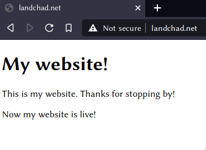
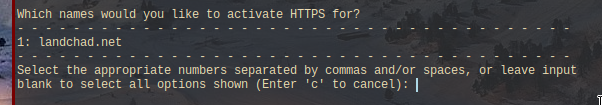
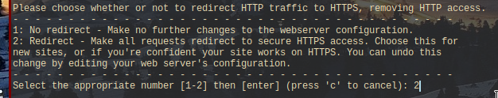
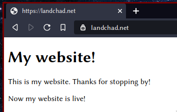

> [Статья на английском с сайта landchad.net](https://landchad.net/basic/certbot/)

После создания веб-сайта крайне важно включить шифрованные
соединения по протоколу HTTPS/SSL. Вы, возможно, даже не представляете, что это значит, но
это легко сделать, когда мы [настроили наш веб-сервер](/basic/nginx/).

Certbot - это программа, которая автоматически создает и развертывает сертификаты
сертификаты, обеспечивающие шифрованные соединения. Раньше это было мучительно
(и часто дорого), но теперь это бесплатно и автоматически.

## Почему важно шифрование SSL?

-   При использовании HTTPS провайдеры не могут следить за тем, что пользователи просматривают на вашем сайте.
    ваш сайт. Они знают, что подключились, но конкретные
    но конкретные страницы, которые они посещают, остаются конфиденциальными, так как все зашифровано. HTTPS
    повышает уровень конфиденциальности пользователей.
-   Если в дальнейшем вы создадите имена пользователей и пароли для любого сервиса на вашем сайте
    отсутствие шифрования может скомпрометировать эти конфиденциальные данные! Большинство
    хорошо разработанное программное обеспечение автоматически *предотвращает* любые незашифрованные
    соединения через Интернет.
-   Поисковые системы, такие как Google, отдают предпочтение страницам с HTTPS по сравнению с незашифрованными
    HTTP.
-   Вы получаете официальный зеленый символ 🔒 в строке URL в большинстве браузеров.
    В большинстве браузеров вы получаете официальный зеленый символ 🔒 в строке URL, что заставляет "нормальных" людей больше доверять вашему сайту.

## Приступим




На этом рисунке видно, что браузер, обращающийся к вашему сайту, скажет \"Не безопасно\" или что-то еще, чтобы уведомить вас о том, что мы используем
незашифрованное HTTP-соединение, а не зашифрованное HTTPS.

## Подготовка

Запустите:

```sh
apt install python3-certbot-nginx
```

При этом будет установлен `certbot` и его модуль для `nginx`.

## Настройка

Как я уже упоминал в предыдущей статье, брандмауэры могут мешать работе certbot
certbot, поэтому необходимо либо отключить брандмауэр, либо, по крайней мере
убедиться, что он разрешает соединения по портам 80 и 443:

```sh
ufw allow 80
ufw allow 443
```

Теперь давайте запустим certbot:

```sh
certbot --nginx
```

Команда попросит вас указать свой e-mail. Это необходимо для того, чтобы, когда
сертификаты необходимо будет обновить через три месяца, вы получите письмо
об этом. Вы можете настроить автоматическое обновление сертификатов, однако
но в первый раз лучше проверить их, чтобы убедиться, что они обновлены правильно.
Вы можете избежать отправки письма, выполнив команду с параметром
`--register-unsafely-without-email`.

Согласитесь с условиями и, по желанию, дайте согласие на передачу вашей электронной почты в EFF
(я не рекомендую этого делать).

После этого появится вопрос о том, для каких доменов вы хотите получить сертификат.
сертификат. Вы можете просто нажать клавишу Enter, чтобы выбрать все.



Создание сертификата займет некоторое время, но после этого вас
будет задан вопрос, хотите ли вы автоматически перенаправлять все соединения на
быть зашифрованными. Так как это предпочтительнее, выберите 2 to Redirect.



### Проверим сайт на наличие SSL

Теперь вы должны иметь возможность зайти на свой сайт и увидеть, что на нем появился значок
🔒 замка или другое уведомление о том, что вы теперь находитесь на зашифрованном соединении
соединение.



## Настройка обновления сертификата

Как я уже упоминал вскользь, срок действия сертификатов Certbot составляет 3 месяца.
Чтобы обновить сертификаты, достаточно выполнить команду `certbot --nginx renew`, и
он обновит все сертификаты, срок действия которых близок к концу.

Конечно, вы не хотите помнить о необходимости входить в систему для обновления сертификатов каждые три месяца.
каждые три месяца, поэтому легко указать серверу автоматически выполнять эту команду.
выполнять эту команду. Для этого мы будем использовать [cronjob](/p/cron). Выполните
следующую команду:

```sh
crontab -e
```

Может появиться небольшое меню с вопросом о том, какой текстовый редактор вы предпочитаете
при выполнении этой команды. Если вы не знаете, как использовать vim,
выберите `nano`, первый вариант.

Эта команда `crontab` откроет файл для редактирования. Кронтаб - это
список команд, которые операционная система будет выполнять автоматически в определенное время
определенное время. Мы собираемся указать ей автоматически пытаться обновлять наши
сертификаты каждый месяц, чтобы нам никогда не приходилось этого делать.

Создайте новую строку в конце файла и добавьте в нее следующее содержимое:

```txt
0 0 1 * * certbot --nginx renew
```

Сохраните файл и выйдите, чтобы активировать этот cronjob.

Более подробную информацию о cron и crontabs можно найти здесь [cronjob](/p/cron)

Теперь у вас есть живой сайт в Интернете. Вы можете добавлять на него все, что
что пожелаете.
