---

title: "Динозаврик google chrome | Создание самой простой игры на JavaScript"
date: 2024-03-12
image: image.png
description:
categories:
    - web
tags:
    - js
------

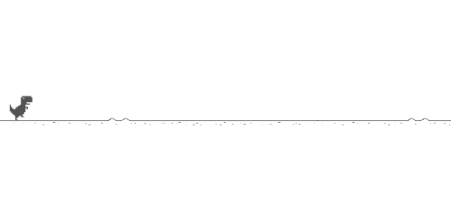

# Динозаврик google chrome на чистом JavaScript

## Создание файлов

Сделайте 3 файла:

- script.js
- index.html
- style.css

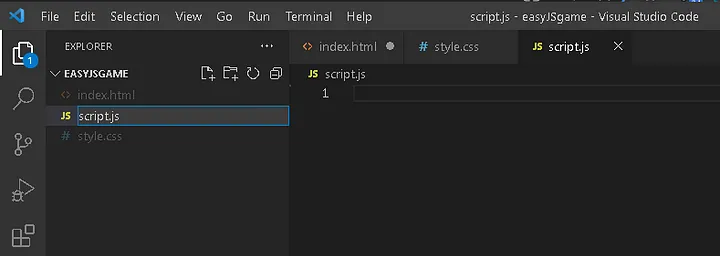

## Скопируйте базовый шаблон HTML

    <!DOCTYPE html>
    <html lang="ru">
        <head>
            <meta charset="UTF-8">
            <title>ДИНОЗАВРИК GOOGLE CHROME CHROME</title>
        </head>
    </html>

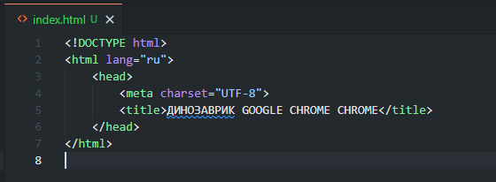

## Добавьте стили и скрипты

Поместите в < head >

    <link rel="stylesheet" href="style.css">

Поместите в < html >

    

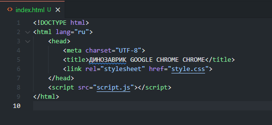

## Пришло время сделать настоящую игру

Определим объекты игры:

    <body>
        

            

            

        

    </body>

Внутри game находятся два объекта - dino и cactus

game - фон игры

dino - динозаврик (главный управляемый персонаж)

cactus - кактусы (враги)

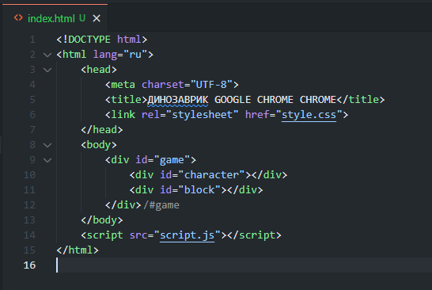

## Оденем динозавра, покрасим кактусы и поклеим обои - style.css

### Определим окно игры (класс game)

    #game{
        width: 500px;
        height: 200px;
        border: 1px solid black;
    }

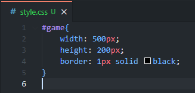

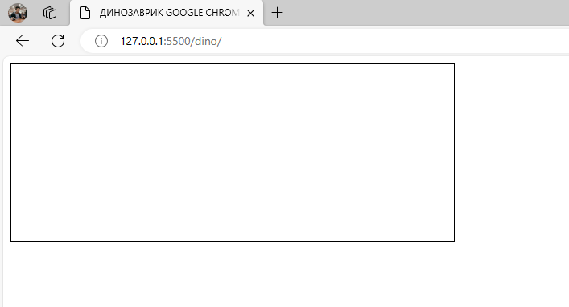

### Создайте персонажа, добавив несколько стилей к символу div

    #dino {
        width: 20px;
        height: 50px;
        background-color: red;
    }

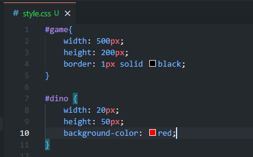

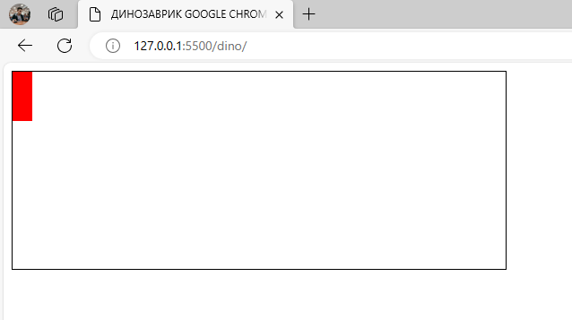

Давайте поместим персонажа в нижнюю часть коробки.

    position: relative;
    top: 150px;

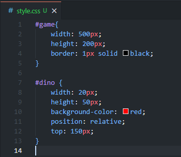

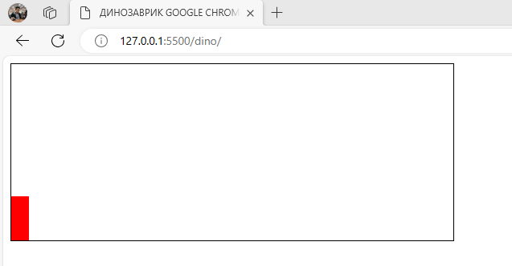

Блок игры имеет высоту 200 пикселей, а наш персонаж - 50 пикселей, поэтому нам нужно опустить его на 150 пикселей, чтобы поместить в самый низ.

### Кактусы

    #cactus{
        width: 20px;
        height: 20px;
        background-color: blue;
        position: relative;
        top: 130px;
        left: 480px;
    }

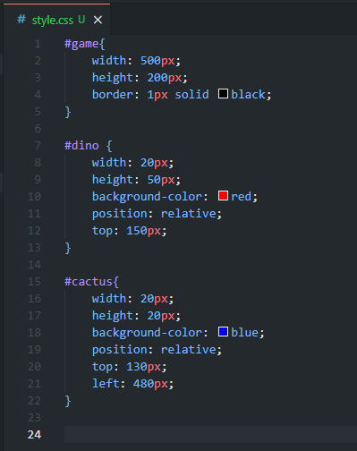

На этот раз мы сдвигаем его до упора вправо.

    ПОЛОЖЕНИЕ КАКТУСА = ШИРИНА ИГРЫ - ШИРИКА КАКТУСА
    480px = 500px - 20px

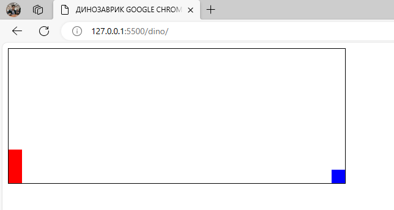

## Добавляем анимацию кактусу

Чтобы наш кактус скользил по направлению к блоку, мы создаем анимацию и добавляем ее в блок.

    #cactus{
        width: 20px;
        height: 20px;
        background-color: blue;
        position: relative;
        top: 130px;
        left: 480px;

        animation: cactus 1s;
    }

    @keyframes cactus {
        0%{left:480px;}
        100%{left:-40px;}
    }

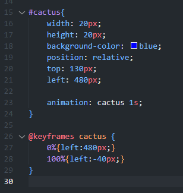

### Бесконечная анимация

Чтобы анимация повторялась, мы добавляем бесконечность в анимацию

    animation: cactus 1s infinite;

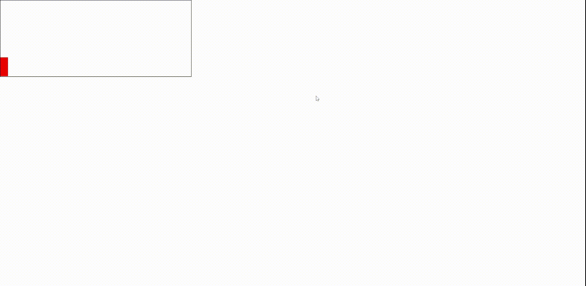

### Линейная анимация

    animation: cactus 1s infinite linear;
