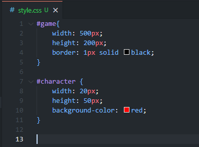
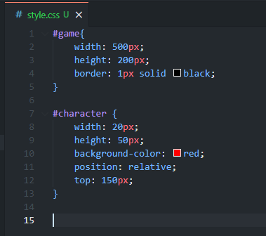

# Динозаврик google chrome на чистом JavaScript

## Создание файлов

Сделайте 3 файла:

- script.js
- index.html
- style.css

## Скопируйте базовый шаблон HTML:

    <!DOCTYPE html>
    <html lang="ru">
        <head>
            <meta charset="UTF-8">
            <title>ДИНОЗАВРИК GOOGLE CHROME CHROME</title>
        </head>
    </html>

## Добавьте стили и скрипты

Поместите в < head >

    <link rel="stylesheet" href="style.css">

Поместите в < html >

    

## Пришло время сделать настоящую игру!

Определим объекты игры:

    <body>
        

            

            

        

    </body>

Внутри game находятся два объекта - dino и cactus

game - фон игры
dino - динозаврик (главный управляемый персонаж)
cactus - кактусы (враги)

## Оденем динозавра, покрасим кактусы и поклеим обои - style.css

### Определим окно игры (класс game):

    #game{
        width: 500px;
        height: 200px;
        border: 1px solid black;
    }

### Создайте персонажа, добавив несколько стилей к символу div.

    #character {
        width: 20px;
        height: 50px;
        background-color: red;
    }

Давайте поместим персонажа в нижнюю часть коробки.

    position: relative;
    top: 150px;

