# Динозаврик google chrome на чистом JavaScript

## Создание файлов

Сделайте 3 файла:

- script.js
- index.html
- style.css

## Скопируйте базовый шаблон HTML:

    <!DOCTYPE html>
    <html lang="ru">
        <head>
            <meta charset="UTF-8">
            <title>ДИНОЗАВРИК GOOGLE CHROME CHROME</title>
        </head>
    </html>

## Добавьте стили и скрипты

Поместите в < head >

    <link rel="stylesheet" href="style.css">

Поместите в < html >

    

## Пришло время сделать настоящую игру!

Определим объекты игры:

    <body>
        

            

            

        

    </body>

Внутри game находятся два объекта - dino и cactus

game - фон игры

dino - динозаврик (главный управляемый персонаж)

cactus - кактусы (враги)

## Оденем динозавра, покрасим кактусы и поклеим обои - style.css

### Определим окно игры (класс game):

    #game{
        width: 500px;
        height: 200px;
        border: 1px solid black;
    }

### Создайте персонажа, добавив несколько стилей к символу div.

    #dino {
        width: 20px;
        height: 50px;
        background-color: red;
    }

Давайте поместим персонажа в нижнюю часть коробки.

    position: relative;
    top: 150px;

Блок игры имеет высоту 200 пикселей, а наш персонаж - 50 пикселей, поэтому нам нужно опустить его на 150 пикселей, чтобы поместить в самый низ.

### Кактусы...

    #cactus{
        width: 20px;
        height: 20px;
        background-color: blue;
        position: relative;
        top: 130px;
        left: 480px;
    }

На этот раз мы сдвигаем его до упора вправо.

    ПОЛОЖЕНИЕ КАКТУСА = ШИРИНА ИГРЫ - ШИРИКА КАКТУСА
    480px = 500px - 20px

## Добавляем анимацию кактусу

Чтобы наш кактус скользил по направлению к блоку, мы создаем анимацию и добавляем ее в блок.

    #cactus{
        width: 20px;
        height: 20px;
        background-color: blue;
        position: relative;
        top: 130px;
        left: 480px;

        
        animation: cactus 1s;
    }

    @keyframes cactus {
        0%{left:480px;}
        100%{left:-40px;}
    }

### Бесконечная анимация

Чтобы анимация повторялась, мы добавляем бесконечность в анимацию

    animation: cactus 1s infinite;

### Линейная анимация

    animation: cactus 1s infinite linear;

## Добавляем анимацию динозавру

Теперь для прыжков, мы создадим вторую анимацию, в которой мы заставляем динозавра прыгать наверх.

Ставим 30 и 70%. Это заставляет его подпрыгивать вверх, немного зависать, а затем снова опускаться.

    @keyframes jump{
        0%{top: 150px;}
        30%{top: 100px;}
        70%{top: 100px;}
        100%{top: 150px;}
    }

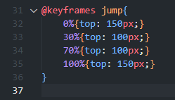

Так же, как и в случае с кактусом, мы добавляем анимацию к нашему динозавру.

    animation: jump 500ms infinite;

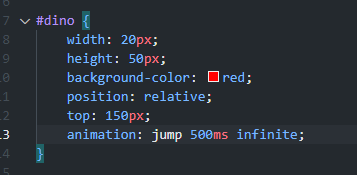

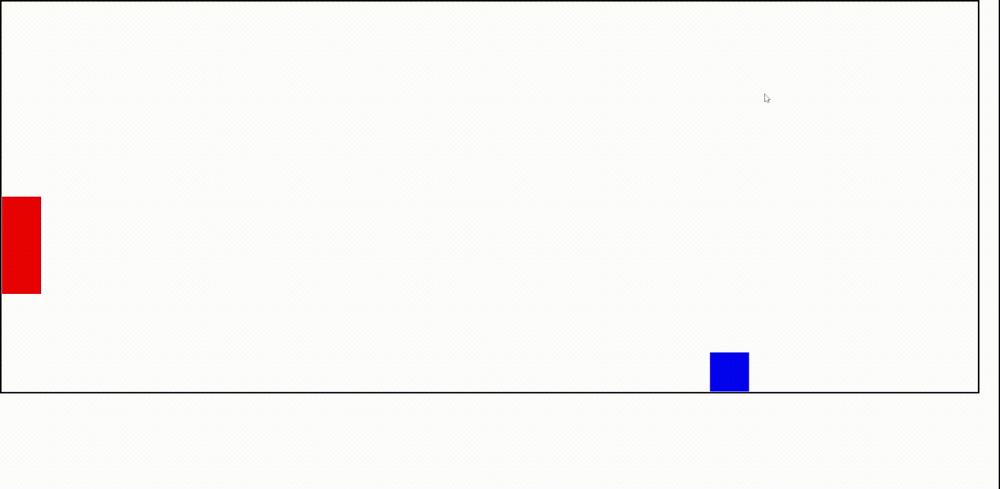

## Управляем динозавром

Мы хотим, чтобы он прыгал, когда мы вызываем функцию JavaScript, которую мы собираемся создать.

### Удаление анимации

Для этого надо удалить анимацию прыжка у динозавра, чтобы он не прыгал сам по себе:

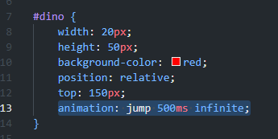
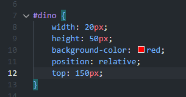

### Создание класса анимации

    .animate{
        animation: jump 500ms;
    }

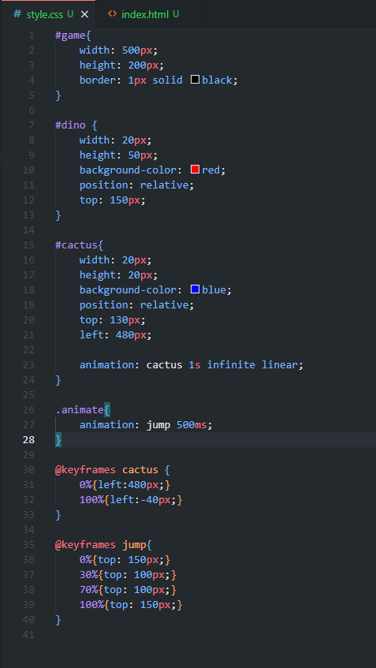

### Пишем JavaScript код

Мы начинаем с создания двух переменных для доступа к нашему динозавру и кактусу.

В файле script.js:

    let character = document.getElementById("dino")
    let block = document.getElementById("cactus")

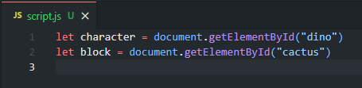

Создадим функцию прыжка:

    function jump() {
        character.classList.add("animate")
    }

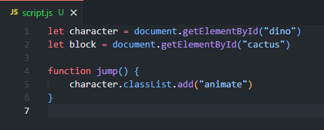

Чтобы запустить нашу функцию, нам нужно добавить onClick в наш index.html (HTML-файл).

    <html lang="en" onclick = "jump()">

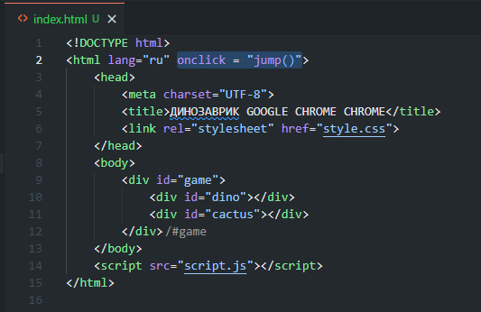

### Почему он прыгает всего один раз?

Добавим удаление класса animate через 500 миллисекунд:

    setTimeout(function(){
        character.classList.remove("animate")
    }, 500)

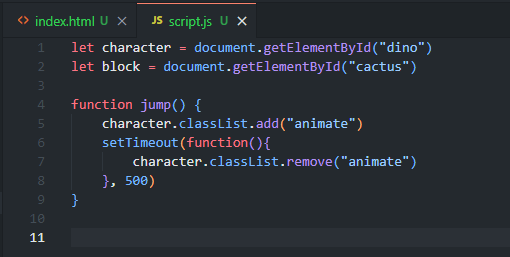

## Игровая логика

Создадим функцию проверки столкновения динозавра с кактусом:

    var checkDead = setInterval(function(){

    },10)

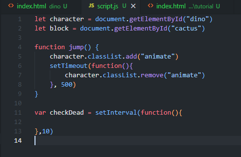

### Где находится динозавр?

Находим положение динозавра

    var checkDead = setInterval(function(){
        var dinoTop = parseInt(
            window.getComputedStyle(character).getPropertyValue("top")
        )
        console.log(dinoTop);
    },10)

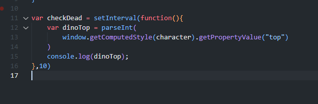

В консоли браузера видим положение в пикселях

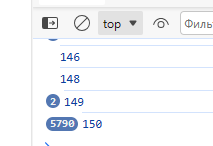

Другими словами: функция проверяет, находится ли динозавр вверху или внизу.

### Где находится кактус?

    var checkDead = setInterval(function(){
        var dinoTop = parseInt(
            window.getComputedStyle(character).getPropertyValue("top")
        )
        console.log("dinoTop = " + dinoTop);

        var cactusLeft = parseInt(
            window.getComputedStyle(block).getPropertyValue("left")
        )
        console.log("cactusLeft = " + cactusLeft);
    },10)

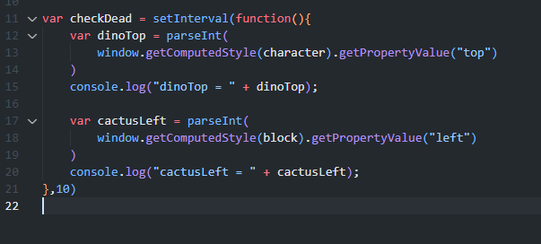

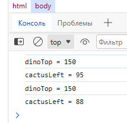

### Проверяем столкновение

Если cactusLeft меньше 20 и больше нуля,
и над персонажем есть пространство более 130 пикселей (что означает, что он не прыгал), то игрок проигрывает.

    if(cactusLeft < 20 && cactusLeft > 0 && dinoTop >= 130){
        alert("caught");
    }

Мы также хотим убрать анимацию кактуса, чтобы он не продолжался после того, как игрок проиграл.

    if(cactusLeft < 20 && cactusLeft > 0 && dinoTop >= 130){
        cactus.style.animation = "none";
        alert("caught");
    }

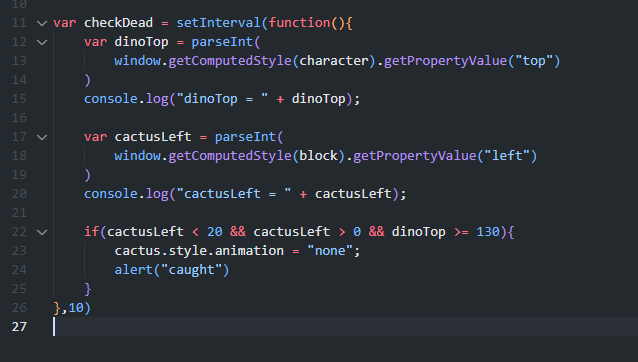