# Основные сведения об информации и информатике

## Понятие информации. 

***Сигнал*** (от лат. *signum* — знак) — физический процесс (явление),
несущий сообщение (информацию) о событии или состоянии объекта
наблюдения.

***Информация*** — специфический атрибут реального мира, представляющий
собой его объективное отражение в виде совокупности сигналов и
проявляющийся при взаимодействии с «приёмником» информации, позволяющим
выделять, регистрировать эти сигналы из окружающего мира и по тому или
иному критерию их идентифицировать.

## Основные свойства и функции информации.

### Функции

1) **познавательная**, цель которой — получение новой информации. Функция
  реализуется в основном через такие этапы обращения информации, как:

‒ её синтез (производство),

‒ представление,

‒ хранение (передача во времени),

‒ восприятие (потребление);

2) **коммуникативная —** функция общения людей, реализуемая через такие
  этапы обращения информации, как:

‒ передача (в пространстве),

‒ распределение;

3) **управленческая**, цель которой — формирование целесообразного
  поведения управляемой системы, получающей информацию. Эта функция
  информации неразрывно связана с познавательной и коммуникативной и
  реализуется через все основные этапы обращения, включая обработку.

### Свойства

***Объективность*** — это характеристика информации, выражающая степень
её соответствия реальной действительности.

***Полнота информации*** — это относительная характеристика, определяющая
количество информации, собранной об объекте или явлении.

***Достоверность информации*** — это характеристика её неискажённости.

***Адекватность информации*** — это её соответствие целям и задачам
информационного обмена.

***Актуальность информации*** — это свойство, характеризующее степень её
соответствия текущему моменту времени.

***Доступность информации*** — это обобщённое свойство, характеризующее
доступность данных и доступность информационных методов, необходимых для
воспроизведения этих данных.

## Количество и качество информации. 

### Количество

***Количество информации*** ( энтропийный
подход). В теории информации и кодирования принят энтропийный подход к
измерению информации. Этот подход основан на том, что факт получения
информации всегда связан с уменьшением разнообразия или неопределенности
(энтропии) системы. Исходя из этого, количество информации в сообщении
определяется как мера уменьшения неопределённости состояния данной
системы после получения сообщения. Неопределённость может быть
интерпретирована в смысле того, насколько мало известно наблюдателю о
данной системе. Как только наблюдатель выявил что-нибудь в физической
системе, энтропия системы снизилась, так как для наблюдателя система
стала более упорядоченной.

*Апостериори* (от лат. *a posteriori —* из последующего) — происходящее
из опыта (испытания, измерения).

*Априори* — (от лат. *a priori* — из предшествующего) — понятие,
характеризующее знание, предшествующее опыту (испытанию), и независимое
от него.

### Качество

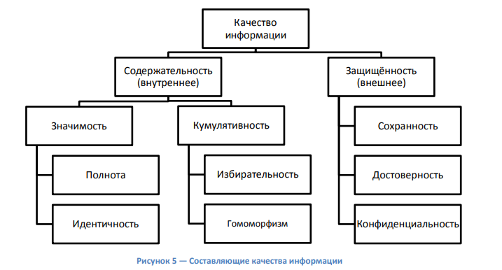

***Качество информации*** — совокупность свойств информации,
характеризующих степень её соответствия потребностям (целям, ценностям)
пользователей (средств автоматизации, персонала и др.).

***Содержательность информации*** — совокупность сведений о конкретном
объекте (системе) или процессе, содержащаяся в сообщениях и
воспринимаемая получателем. Содержательность отражает семантическую
ёмкость информации, содержащейся в информационных массивах (массивах
данных, массивах программ, сообщениях, фактах). Содержательная
информация используется, как правило, для выработки и принятия
управляющего воздействия.

***Значимость информации*** — свойство информации сохранять ценность для
потребителя с течением времени, т.е. не подвергаться «моральному»
старению.

***Полнота информации*** — свойство содержательной информации,
характеризуемое мерой её достаточности для решения определенных задач.

***Идентичность*** — свойство, заключающееся в соответствии содержательной
информации состоянию объекта.

***Кумулятивность информации*** — свойство содержательной информации,
заключённой в массиве небольшого объёма, достаточно полно отображать
действительность.

***Избирательность информации*** — свойство содержательной информации,
заключающееся в достаточно полном отображении действительности,
представленной информационными массивами большого объёма, с помощью
малого числа информационных единиц (символов) на основе учёта
квалификации, опыта и других качеств конкретного потребителя.

***Гомоморфизм информации*** — свойство содержательной информации, связанное
с достаточно полным отображением действительности, представленной
информационными массивами большого объёма, с помощью малого числа
информационных единиц (символов) на основе соответствующих моделей
агрегирования.

***Защищённость*** отражает внешнее качество информации, определяемое
совокупностью свойств информации, обеспечиваемых системой контроля и
защиты информации (КЗИ) в конкретной информационной системе. Основными
из них являются свойства, заключающиеся в способности не допускать
случайного или целенаправленного искажения или разрушения, раскрытия или
модификации информационных массивов, соответственно достоверность,
конфиденциальность и сохранность информации. При переносе информации в
другую систему (среду) эти свойства исчезают.

***Достоверность информации*** — свойство информации, характеризуемое
степенью соответствия (в пределах заданной точности) реальных
информационных единиц (символов, знаков, записей, сообщений,
информационных массивов и т.д.) их истинному значению и определяемое
способностью КЗИ обеспечить отсутствие ошибок переработки информации,
т.е. не допустить снижения ценности информации при принятии
управленческих решений, искажений информационных массивов (ИМ), их
смыслового значения, замены единичных символов ИМ и других из-за
несовершенства организации (структуры) процесса переработки,
несовершенства алгоритмов, ненадёжной работы аппаратно-программных
средств, ошибок пользователей и т.д.

***Конфиденциальность информации*** — свойство информации, позволяющее
сохранять предоставленный ей статус. Конфиденциальность информации
характеризуется такими показателями, как доступность, скрытность и
имитостойкость информации.

*Доступность информации* характеризуется степенью разграничения действий
объектов информационной системы (операторов, задач, устройств, программ,
подсистем и др.) и заключается в возможности использования ИМ по
требованию объектов системы, имеющих соответствующие полномочия
(мандаты).

*Скрытность информации* характеризуется степенью маскировки информации и
отражает её способность противостоять раскрытию смысла ИМ (семантическая
скрытность на основе обратимых преобразований информации), определению
структуры хранимого ИМ или носителя (сигналапереносчика) передаваемого
ИМ (структурная скрытность на основе необратимых преобразований,
использования спецаппаратуры, различных форм сигналов-переносчиков,
видов модуляции и др.) и установлению факта передачи ИМ по каналам связи
(энергетическая скрытность на основе применения широкополосных
сигналов-переносчиков ИМ, организации периодического маскирующего обмена
ИМ и др.).

*Имитостойкость информации* определяется степенью её защищённости от
внедрения ИМ, имитирующих авторизованные (зарегистрированные) массивы, и
заключается в способности не допустить навязывания дезинформации и
нарушения нормального функционирования информационной системы.

***Сохранность информации*** — свойство информации, характеризуемое
степенью готовности определённых ИМ к целевому применению и определяемое
способностью КЗИ обеспечить постоянное наличие и своевременное
предоставление ИМ, необходимых для автоматизированного решения целевых и
функциональных задач системы, т.е. не допускать разрушения ИМ из-за
несовершенства носителей, механических повреждений, неправильной
эксплуатации, износа и старения аппаратных средств, ошибок персонала и
несанкционированных корректировок, недостатков в программных средствах и
т.д. Основными показателями сохранности являются целостность и
готовность информации.

*Целостность информации* характеризуется степенью аутентичности
(подлинности) ИМ в информационной базе и исходных документах
(сообщениях) и определяется способностью КЗИ обеспечить, насколько это
возможно, физическое наличие информационных единиц в информационной базе
в любой момент времени, т.е. не допустить случайных искажений и
разрушения ИМ из-за дефектов и сбоев аппаратных средств, действия
«компьютерных вирусов», ошибок оператора (при вводе информации в
информационную базу или обращении к ней), ошибок в программных средствах
(операционных системах, СУБД, комплексах прикладных программ и др.).

*Готовность информации* характеризуется степенью работоспособности ИМ
при выполнении целевых и функциональных задач системы и определяется
возможностью КЗИ обеспечить своевременное предоставление необходимых
неразрушенных ИМ.

## Уровни проблем передачи информации. 

***Сообщение*** — форма представления информации в виде совокупности
знаков (символов), используемая для передачи.

Сообщение как совокупность знаков с точки зрения семиотики (от греч.
*sêmeion* — знак, признак) — науки, занимающейся исследованием свойств
знаков и знаковых систем, может изучаться на трёх уровнях:

- *синтаксическом,* где рассматриваются внутренние свойства сообщений,
  т.е. отношения между знаками, отражающие структуру данной знаковой
  системы. Внешние свойства изучают на семантическом и прагматическом
  уровнях;

- *семантическом,* где анализируются отношения между знаками и
  обозначаемыми ими предметами, действиями, качествами, т.е. смысловое
  содержание сообщения, его отношение к источнику информации;

- *прагматическом,* где рассматриваются отношения между сообщением и
  получателем, т.е. потребительское содержание сообщения, его отношение
  к получателю.

Проблемы ***синтаксического уровня*** касаются создания теоретических
основ построения информационных систем, основные показатели
функционирования которых были бы близки к предельно возможным, а также
совершенствования существующих систем с целью повышения эффективности их
использования. Это чисто технические проблемы совершенствования методов
передачи сообщений и их материальных носителей — сигналов. На этом
уровне рассматривают проблемы доставки получателю сообщений как
совокупности знаков, учитывая при этом тип носителя и способ
представления информации, скорость передачи и обработки, размеры кодов
представления информации, надёжность и точность преобразования этих
кодов и т.п., полностью абстрагируясь от смыслового содержания сообщений
и их целевого предназначения. На этом уровне информацию, рассматриваемую
только с синтаксических позиций, обычно называют данными, так как
смысловая сторона при этом не имеет значения.

Проблемы ***семантического уровня*** связаны с формализацией и учётом
смысла передаваемой информации, определения степени соответствия образа
объекта и самого объекта. На данном уровне анализируются те сведения,
которые отражает информация, рассматриваются смысловые связи,
формируются понятия и представления, выявляется смысл, содержание
информации, осуществляется её обобщение.

На ***прагматическом уровне*** интересуют последствия от получения и
использования данной информации потребителем. Проблемы этого уровня
связаны с определением ценности и полезности использования информации
при выработке потребителем решения для достижения своей цели. Основная
сложность здесь состоит в том, что ценность, полезность информации может
быть совершенно различной для различных получателей и, кроме того, она
зависит от ряда факторов, таких, например, как своевременность её
доставки и использования. Высокие требования в отношении скорости
доставки информации часто диктуются тем, что управляющие воздействия
должны осуществляться в реальном масштабе времени, т.е. со скоростью
изменения состояния управляемых объектов или процессов. Задержки в
доставке или использовании информации могут иметь катастрофические
последствия.

## Меры информации различного уровня.

### Меры информации синтаксического уровня 

Количественная оценка информации этого уровня не связана с
содержательной стороной информации, а оперирует с обезличенной
информацией, не выражающей смыслового отношения к объекту. В связи с
этим данная мера даёт возможность оценки информационных потоков в таких
разных по своей природе объектах, как системы связи, вычислительные
машины, системы управления, нервная система живого организма и т.п.

*Объём информации*  *(объёмный подход).* При
реализации информационных процессов информация передаётся в виде
сообщения, представляющего собой совокупность символов какоголибо
алфавита. При этом каждый новый символ в сообщении увеличивает
количество информации, представленной последовательностью символов
данного алфавита. Если теперь количество информации, содержащейся в
сообщении из одного символа, принять за единицу, то объём информации
(данных)  в любом другом сообщении
будет равен количеству символов (разрядов) в этом сообщении. Так как
одна и та же информация может быть представлена многими разными
способами (с использованием разных алфавитов), то и единица измерения
информации (данных) соответственно будет меняться.

*Количество информации*
 *(энтропийный
подход).* В теории информации и кодирования принят энтропийный подход к
измерению информации. Этот подход основан на том, что факт получения
информации всегда связан с уменьшением разнообразия или неопределенности
(энтропии) системы. Исходя из этого, количество информации в сообщении
определяется как мера уменьшения неопределённости состояния данной
системы после получения сообщения. Неопределённость может быть
интерпретирована в смысле того, насколько мало известно наблюдателю о
данной системе. Как только наблюдатель выявил что-нибудь в физической
системе, энтропия системы снизилась, так как для наблюдателя система
стала более упорядоченной.

### Меры информации семантического уровня 

Для измерения смыслового содержания информации, т.е. её количества на
семантическом уровне, наибольшее распространение получила тезаурусная
мера, которая связывает семантические свойства информации со
способностью пользователя принимать поступившее сообщение.
Действительно, для понимания и использования полученной информации
получатель должен обладать определенным запасом знаний. Полное незнание
предмета не позволяет извлечь полезную информацию из принятого сообщения
об этом предмете. По мере роста знаний о предмете растёт и количество
полезной информации, извлекаемой из сообщения.

Если назвать имеющиеся у получателя знания о данном предмете
«тезаурусом» (т.е. неким сводом слов, понятий, названий объектов,
связанных смысловыми связями), то количество информации, содержащееся в
некотором сообщении, можно оценить степенью изменения индивидуального
тезауруса под воздействием данного сообщения.

***Тезаурус* —** совокупность сведений, которыми располагает пользователь или система.

Иными словами, количество семантической информации, извлекаемой
получателем из поступающих сообщений, зависит от степени
подготовленности его тезауруса для восприятия такой информации.

### Меры информации прагматического уровня 

Эта мера определяет полезность информации (ценность) для достижения
пользователем поставленной цели. Она также величина относительная,
обусловленная особенностями использования этой информации в той или иной
системе.

Дальнейшее развитие данного подхода базируется на статистической теории
информации и теории решений. Сущность метода состоит в том, что, кроме
вероятностных характеристик неопределённости объекта, после получения
информации вводятся функции штрафов или потерь и оценка информации
производится в результате минимизации потерь. Максимальной ценностью
обладает то количество информации, которое уменьшает потери до ноля при
достижении поставленной цели.

# Представление информации в ЭВМ

## Система счисления: понятие, свойства, виды. 

***Система счисления*** — совокупность приёмов и правил наименования и
обозначения чисел, позволяющих установить взаимно однозначное
соответствие между любым числом и его представлением в виде конечного
числа символов.

## Позиционная и непозиционная система счисления. 

***Непозиционная система счисления*** — система, в которой символы,
обозначающие то или иное количество, не меняют своего значения в
зависимости от местоположения (позиции) в изображении числа.

***Непозиционной системой*** счисления является самая простая система с одним
символом (палочкой). Для изображения какого-либо числа в этой системе
надо записать количество палочек, равное данному числу. Эта система
неэффективна, так как форма записи очень громоздка.

# !!!!!!!!!!!!!!!!!!!!!!!!!!!!!!!!!!!!!!!!!!!!!!
## Перевод чисел из одной системы счисления в другую. 

### Перевод целых чисел.

### Перевод правильных дробей

## Двоичная, восьмеричная, шестнадцатеричная системы счисления. 

В современной вычислительной технике, в устройствах автоматики и связи
используется в основном двоичная система счисления, что обусловлено
рядом преимуществ данной системы счисления перед другими системами. Так,
для её реализации нужны технические устройства лишь с двумя устойчивыми
состояниями, например материал намагничен или размагничен (магнитные
ленты, диски), отверстие есть или отсутствует (перфолента и перфокарта).
Этот обеспечивает более надёжное и помехоустойчивое представление
информации, дает возможность применения аппарата булевой алгебры для
выполнения логических преобразований информации. Кроме того,
арифметические операции в двоичной системе счисления выполняются
наиболее просто.

Недостаток двоичной системы — быстрый рост числа разрядов, необходимых
для записи больших чисел. Этот недостаток не имеет существенного
значения для ЭВМ. Если же возникает необходимость кодировать информацию
«вручную», например, при составлении программы на машинном языке, то
используют восьмеричную или шестнадцатеричную системы счисления. Числа в
этих системах читаются почти так же легко, как десятичные, требуют
соответственно в три (восьмеричная) и в четыре (шестнадцатеричная) раза
меньше разрядов, чем в двоичной системе (числа 8 и 16 — соответственно
третья и четвёртая степени числа 2), а перевод их в двоичную систему
счисления и обратно осуществляется гораздо проще в сравнении с
десятичной системой счисления.

Перевод восьмеричных и шестнадцатеричных чисел в двоичную систему
осуществляется путём замены каждой цифры эквивалентной ей двоичной
триадой (тройкой цифр) или тетрадой (четвёркой цифр) соответственно.

Чтобы перевести число из двоичной системы в восьмеричную или
шестнадцатеричную, его нужно разбить влево и вправо от запятой на триады
(для восьмеричной) или тетрады (для шестнадцатеричной) и каждую такую
группу заменить соответствующей восьмеричной или шестнадцатеричной
цифрой.

Правила выполнения арифметических операций сложения, вычитания,
умножения и деления в 2-, 8- и 16-ичной системах счисления, как было
отмечено выше, будут такими же, как и в десятичной системе, только надо
пользоваться особыми для каждой системы таблицами сложения и умножения.

При сложении цифры суммируются по разрядам, и если при этом возникает
избыток, то он переносится влево.

Выполняя умножение многозначных чисел в различных позиционных системах
счисления, можно использовать обычный алгоритм перемножения чисел в
столбик, но при этом результаты перемножения и сложения однозначных
чисел необходимо брать из соответствующих рассматриваемой системе таблиц
умножения и сложения.

Ввиду чрезвычайной простоты таблицы умножения в двоичной системе
умножение сводится лишь к сдвигам множимого и сложениям.

Деление в данных системах счисления, как и в любой другой позиционной
системе счисления, производится по тем же правилам, как и деление углом
в десятичной системе. В двоичной системе деление выполняется особенно
просто, так как очередная цифра частного может быть только нолем или
единицей.

### Двоично-десятичная система счисления 

Двоично-десятичная система счисления (ДДСС) широко используется в
цифровых устройствах, когда основная часть операций связана не с
обработкой и хранением вводимой информации, а с её вводом и выводом на
какие-либо индикаторы с десятичным представлением полученных результатов
(микрокалькуляторы, кассовые аппараты и т.п.).

В двоично-десятичной системе десятичные цифры от 0 до 9 представляют
4-разрядными двоичными комбинациями от 0000 до 1001, т.е. двоичными
эквивалентами десяти первых шестнадцатеричных цифр. Преобразования из
двоично-десятичной системы в десятичную систему счисления (ДСС) (и
обратные преобразования) не вызывают затруднений и выполняются путём
прямой замены четырёх двоичных цифр одной десятичной цифрой (или
обратной замены).

Две двоично-десятичные цифры составляют 1 байт. Таким образом, с помощью
1 байта можно представлять значения от 0 до 99, а не от 0 до 255, как
при использовании 8-разрядного двоичного числа. Используя 1 байт для
представления каждых двух десятичных цифр, можно формировать
двоично-десятичные числа с любым требуемым числом десятичных разрядов.

Сложение двоично-десятичных чисел, имеющих один десятичный разряд,
выполняется так же, как и сложение 4-разрядных двоичных чисел без знака,
за исключением того, что при получении результата, превышающего 1001,
необходимо производить коррекцию. Результат корректируется путём
прибавления двоичного кода числа 6, т.е. кода 0110.

Если первоначальное двоичное сложение или прибавление корректирующего
числа приводит к возникновению переноса, то при сложении многоразрядных
двоично-десятичных чисел перенос осуществляется в следующий десятичный
разряд.

## Прямой, обратный, дополнительный двоичный коды. 

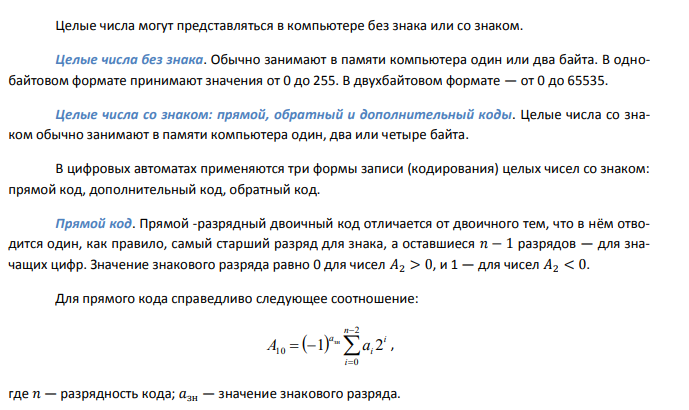

***Дополнительный код***. Использование чисел со знаком (прямого кода
представления чисел) усложняет структуру ЭВМ. В этом случае операция
сложения двух чисел, имеющих разные знаки, должна быть заменена на
операцию вычитания меньшей величины из большей и присвоения результату
знака большей величины. Поэтому в современных ЭВМ, как правило,
отрицательные числа представляют в виде дополнительного или обратного
кодов, что при суммировании двух чисел с разными знаками позволяет
заменить вычитание на обычное сложение и упростить тем самым конструкцию
арифметико-логического устройства компьютера.

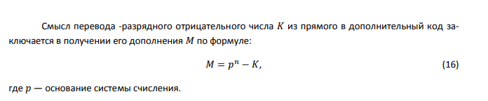

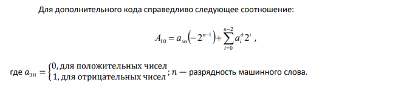

***Обратный код***. Для представления отрицательных чисел используется
также обратный код, который получается инвертированием всех цифр
двоичного кода абсолютной величины числа: ноли заменяются единицами, а
единицы — нолями. При этом, необходимо помнить, что все операции с
отрицательными числами выполняются в формате машинного слова. Это
значит, что к двоичному числу слева дописываются ноли до нужного
количества разрядов

> Для обратного кода справедливо следующее соотношение:

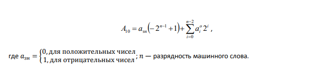

## Выполнение арифметических операций над двоичными числами. 

***Сложение обратных кодов***. В этом случае при сложении чисел X и Y
имеют место четыре основных и два особых случая:

1.  Х и Y положительные. При суммировании складываются все разряды,
    включая разряд знака. Так как знаковые разряды положительных
    слагаемых равны нулю, разряд знака суммы тоже равен нулю.

2.  X положительное, Y отрицательное и по абсолютной величине больше,
    чем X.

3.  X положительное, Y отрицательное и по абсолютной величине меньше,
    чем X. Компьютер исправляет полученный первоначально некорректный
    результат переносом единицы из знакового разряда в младший разряд
    суммы.

4.  X и Y отрицательные. Полученный первоначально некорректный результат
    компьютер исправляет переносом единицы из знакового разряда в
    младший разряд суммы. При переводе результата в прямой код биты
    цифровой части числа инвертируются.

При сложении может возникнуть ситуация, когда старшие разряды результата
операции не помещаются в отведённой для него области памяти. Такая
ситуация называется переполнением разрядной сетки формата числа. Для
обнаружения переполнения и оповещения о возникшей ошибке в компьютере
используются специальные средства. Ниже приведены два возможных случая
переполнения.

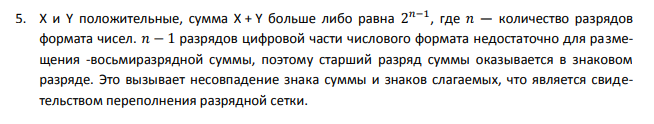

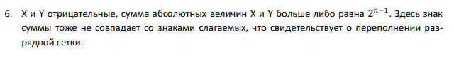

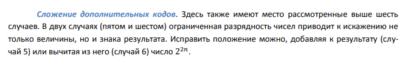

## Представление числовой, символьной, графической, мультимедийной информации в ЭВМ.

Б*о*льшую часть поступающей информации люди используют для управления
своими действиями, своим состоянием и мышлением. Однако у
информационного обмена есть и вторая задача: передача, приобретение и
накопление знаний.

Чтобы поступающая информация стала знанием, она должна быть упорядочена
и сохранена (запомнена). Информация хранится в форме данных. Поскольку
данные представляют собой зарегистрированные сигналы, можно сделать
вывод, что сохранение информации заключается в регистрации сигналов.
Происходит это во время процесса, который называется записью. В данном
случае речь идет о записи как о процессе.

***Запись данных*** — это процесс регистрации сигналов. Запись
информации — это управляемый процесс регистрации сигналов.

***Кодирование*** — это управляемый процесс представления элементов
информационных объектов элементами данных.

***Аналоговое кодирование*** — это способ кодирования, основанный на
принципе регистрации непрерывной последовательности сигналов
определенной физической природы в виде подобной ей последовательности
данных другой физической природы.

Характерными техническими системами, реализующими аналоговое
кодирование, являются:

- фотографические устройства (кроме цифровых);

- магнитофоны и видеокамеры (не цифровые);

- устройства приёма и передачи радиосигналов.

***Табличное кодирование*** — это способ кодирования, основанный на
принципе формирования дискретной выборки данных по результатам
периодического сопоставления регистрируемого сигнала с
элементами-образцами предварительно заданного набора.

***Цифровое кодирование*** — это способ кодирования, основанный на
принципе формирования выборки данных путём периодического измерения
величины регистрируемого сигнала и записи числовых значений,
пропорциональных результатам измерений.

# Логические функции

## Основные законы и постулаты алгебры логики. 

### Аксиомы (постулаты) алгебры логики 

1.  Дизъюнкция двух переменных равна 1, если хотя бы одна из них равна 1.

2.  Конъюнкция двух переменных равна 0, если хотя бы одна переменная равна 0.

3.  Инверсия одного значения переменной совпадает с её другим значением.

### Законы алгебры логики 

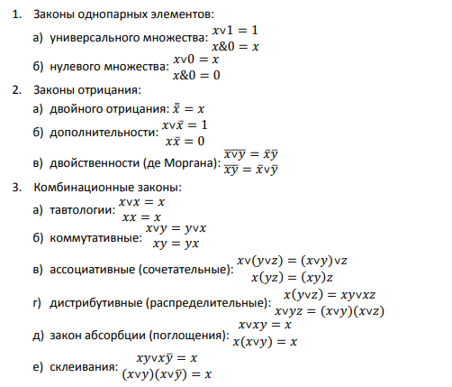

# !!!!!!!!!!!!!!!!!!!!!!!!!!
## Представление логических функций: аналитическое, табличное, графическое

## Построение совершенной дизъюнктивной нормальной формы логической функции.

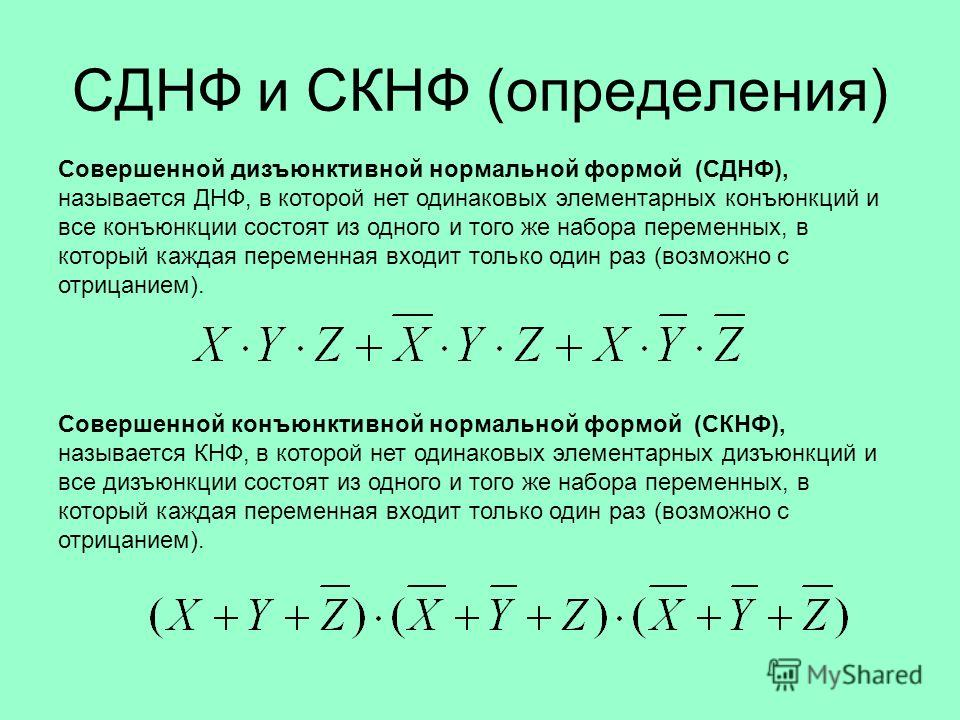

## Вычисление логических функций.

***Алгебра логики*** — раздел математики, изучающий высказывания,
рассматриваемые со стороны их логических значений (истинности или
ложности) и логических операций над ними.

***Высказывание*** — некоторое предложение, в отношении которого можно
однозначно сказать, истинно оно или ложно.

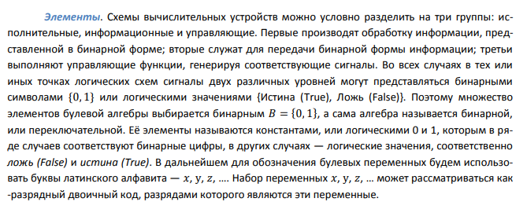

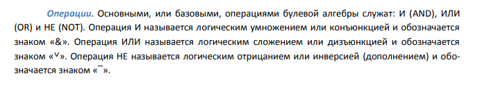

# Основные компоненты ПК и их функции

## Техническое и программное обеспечение ПК. 

## Аппаратное обеспечение и структура системного блока. 

## Классификация программного обеспечения ПК. 

## Периферийные устройства.

# Работа с электронными документами

##  Принципы и особенности работы с приложениями пакетов прикладных программ MS Office (Word, Excel, PowerPoint, Access), OpenOffice, LibreOffice

# Защита информации

## Понятие ошибки, кратность ошибки. Помехоустойчивое кодирование информации: основные понятия помехоустойчивого кодирования; принципы помехоустойчивого кодирования; общий подход к обнаружению ошибок; общий подход к исправлению ошибок. 

***Ошибкой*** называется искажение вектора кода. Кратностью ошибки называется число компонент вектора, искажаемых ошибкой.

### Общий подход к обнаружению ошибок 

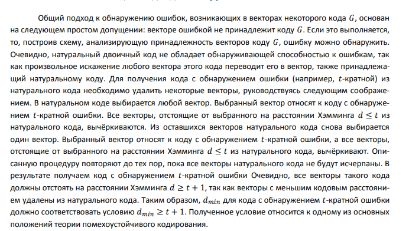

### Общий подход к исправлению ошибок 

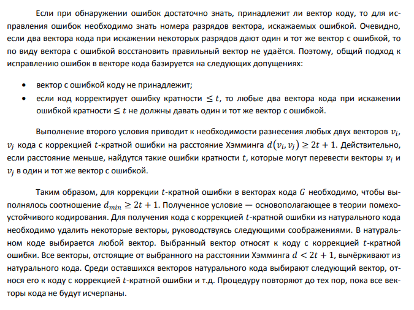

## Исправление однократной ошибки в сообщении. 

## Построение кода, устойчивого к ошибкам, избыточность информацию.

# Классификация программного обеспечения

## Системное, прикладное, инструментальное программное обеспечение. Понятие и сновные функции операционной системы. 

## Понятие и основные функции и типы файловой системы. Локальные и глобальные структуры и принципы организации компьютерных сетей