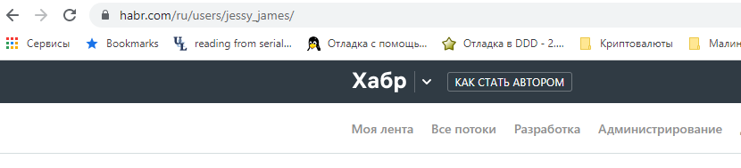
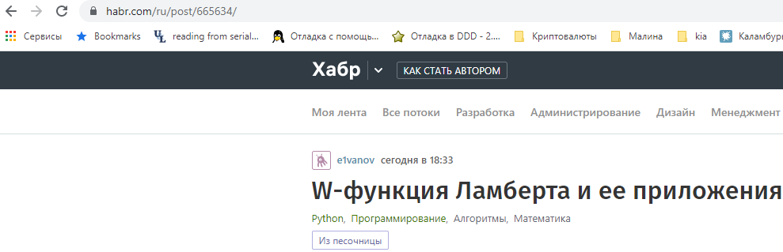
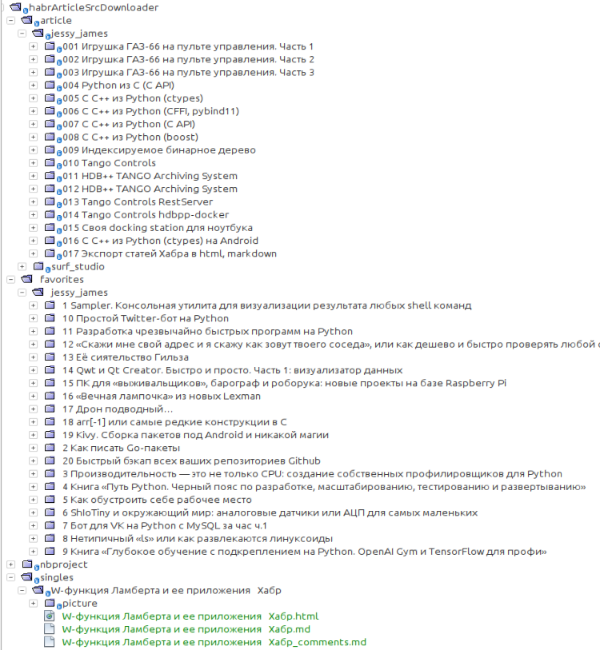
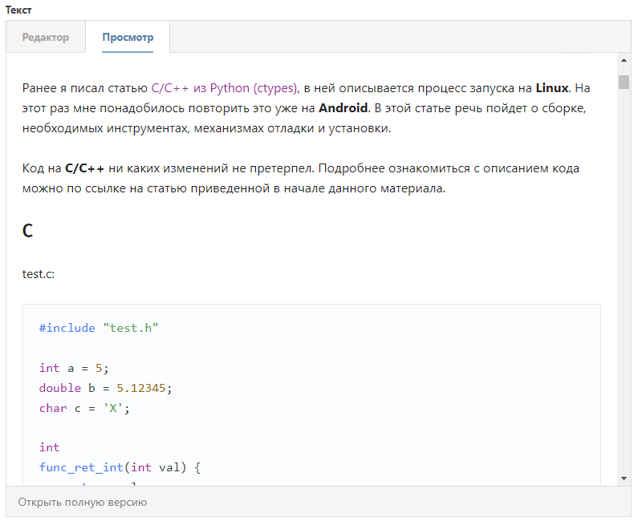

# Экспорт статей Хабра в html, markdown
Url: https://habr.com/ru/post/665254


Author: Jessy\_James


Date: 2022-05-11, 20:15


 

  

До меня было написано 4 статьи по экспорту статей с хабра в **FB2** и **pdf**:

  

* [Экспорт избранного Хабра в FB2](https://habr.com/ru/post/116982/)
* [Экспорт избранного Хабра в FB2 — скоростная PHP-версия](https://habr.com/ru/post/170755/)
* [Экспорт Хабра в FB2](https://habr.com/ru/post/174649/)
* [Экспорт Избранного на Хабре в PDF](https://habr.com/ru/post/208802/)

  

Я захотел получить исходники своих статей.  Поскольку для написания на хабре пользуюсь старым редактором и пишу в **markdown**, то и основная цель была получить исходник markdown. HTML пошел прицепом, т.к. статьи с хабра получаю в нем, а затем с помощью библиотеки [markdownify](https://github.com/matthewwithanm/python-markdownify) и некоторых танцев с бубном получаю md.

  

## Как пользоваться

  

Скрипт написан на python3, скачиваем с github, устанавливаем зависимости и запускаем:

  


```bash
git clone https://github.com/dvjdjvu/habrArticleSrcDownloader
cd habrArticleSrcDownloader
apt-get install python3-lxml libomp-dev
pip3 install -r requirements.txt
```
  

Скачиваем статьи пользователя:

  


```bash
./src/main.py -u jessy_james
```
  

Скачиваем закладки пользователя:

  


```bash
./src/main.py -f jessy_james
```
  

Скачиваем одиночную статью:

  


```bash
./src/main.py -s 665634
```
  

Вместо *jessy\_james* подставить имя нужного пользователя. Взять можно из ссылки профиля:

  

  

Вместо *665634* подставить **id** нужной статьи. Взять из ссылки на статью:

  

  

После запуска получаем такую картину:

  


```bash
./src/main.py -u jessy_james
[info]: Скачивается: C/C++ из Python (ctypes) на Android
[info]: Директория: 16 C C++ из Python (ctypes) на Android создана
[info]: Директория: picture создана
[info]: Статья: C C++ из Python (ctypes) на Android сохранена
[info]: Скачивается: Своя docking station для ноутбука
[info]: Директория: 15 Своя docking station для ноутбука создана
[info]: Директория: picture создана
[info]: Статья: Своя docking station для ноутбука сохранена
[info]: Скачивается: Tango Controls hdbpp-docker
[info]: Директория: 14 Tango Controls hdbpp-docker создана
[info]: Директория: picture создана

...

[info]: Скачивается: Игрушка ГАЗ-66 на пульте управления. Часть 2
[info]: Директория: 2 Игрушка ГАЗ-66 на пульте управления. Часть 2 создана
[info]: Директория: picture создана
[info]: Статья: Игрушка ГАЗ-66 на пульте управления. Часть 2 сохранена
[info]: Скачивается: Игрушка ГАЗ-66 на пульте управления. Часть 1
[info]: Директория: 1 Игрушка ГАЗ-66 на пульте управления. Часть 1 создана
[info]: Директория: picture создана
[info]: Статья: Игрушка ГАЗ-66 на пульте управления. Часть 1 сохранена
```
  

Статьи скачиваются от последней написанной к первой. Нумерация будет в порядки написания или добавления в закладки.

  

Иерархия каталога будет такой:

  

  

Создается папка **article**, **favorites** или **singles**, далее папка с именем пользователя, далее папки с названиями статей. В папке со статьей будет два файла (**.md** и **.html**) и папка с картинками статьи.

  

Смотрим что получилось, берем содержимое полученного файла markdown и вставляем в редактор статей:

  



  

Почти работает как я хотел ;), есть некоторые проблемы с отображением изображений (исходник html отображает правильнее). Постараюсь их исправить.

  

Спасибо за внимание.

  

## Ссылки

  

* [Исходный код скрипта](https://github.com/dvjdjvu/habrArticleSrcDownloader)
    