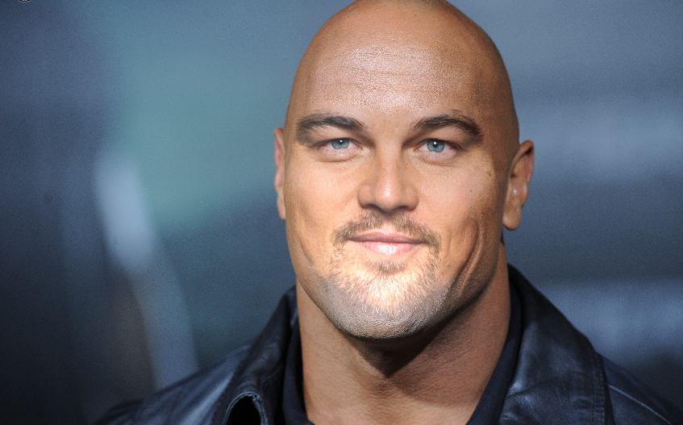

# Перейдем в фотошоп онлайн

[https://фотошопонлайн.рф](https://xn--80asehdbaaaj4aw9c.xn--p1ai/)

## Будем менять лицо "Скалы" на Леонардо Ди Каприо

### Скала

[Открыть картинку Скалы в браузере](https://w.forfun.com/fetch/52/52cbaca7c46456b07193c5202cce648a.jpeg)

### Леонардо Ди Каприо

[Открыть картинку Леонардо Ди Каприо в браузере](https://w.forfun.com/fetch/c9/c950ecdb4c2e68c5f1c56eaaf39eb421.jpeg)

## Создадим новый файл с Леонардо

Скопируем фотографию Ди Каприо. Нажми на Скопировать и Вставить...

Вставим скопированную картинку в это поле

У нас открылся новый файл.

## Создадим новый файл со Скалой

Файл -> Новый

Нажми на Скопировать и Вставить...

Скопируй фотографию со скалой и вставь в это поле.

Теперь у нас есть новая вкладка. (всего две)

## Выделим и скопируем выделенное лицо

Найдем нашего Ди Каприо. Выбираем инструмент "Выделение магнитное лассо"

И можем неаккуратно выделить основную часть лица - брови, глаза, нос, рот, борода.

Уши выделять не надо. А вот лоб можешь попробовать выделить.

Теперь скопируем выделенную область сочетанием клавиш CTRL+C

Перейдем во вкладку со Скалой

Вставим Выделенное лицо с помощью сочения клавиш CTRL+V

## Примеряем "маску"

Сдаем непрозрачность слоя лица Ди Каприо на 50%

Выберем инструмент Редактирование->Свободное трансформирование

Теперь надо изменить размер лица Ди Каприо так, чтобы его глаза совпали с глазами Скалы.

Теперь ластиком убираем выпирающие части лица. (Можно убрать зону ушей). Убрать бороду, или наоборот, оставить её. Самое главное - лицо Ди Каприо не должно быть больше лица Скалы.

Примерно так.

## Применяем магию

Все слои должны быть со 100% непрозрачностью.

И выдели два слоя - лицо Ди Каприо и Скалу.

Выбираем инструмент Редактирование -> Автоматическое смешивание.

Теперь подожди пару минут, идёт магия. Фотошоп задумается, но ты не мешай ему.

У меня получился такой результат. 

