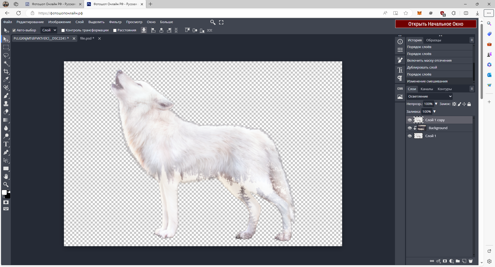

# Скачать урок

[Двойная-экспозиция-в-фотошопе.pdf](Двойная-экспозиция-в-фотошопе.pdf)

[Двойная-экспозиция-в-фотошопе.docx](Двойная-экспозиция-в-фотошопе.docx)

# Перейдем в фотошоп онлайн

[https://фотошопонлайн.рф](https://xn--80asehdbaaaj4aw9c.xn--p1ai/)

## Примеры

  

## Будем создавать эффект двойной экспозиции из двух фотографий

### Волк

[Открыть картинку волка в браузере](https://cdn131.picsart.com/282175409010211.png)

### Лес

[Открыть картинку леса в браузере](https://lencodigitexer.github.io/p/двойная-экспозиция-в-фотошопе/forest.jpg)

## Откроем два файла в фотошопе

## Скопируем волка и вставим в файл с лесом

Зажимая CTRL кликаем по миниатюре волка

Волк выделился. Теперь скопируем выделенную область сочетанием клавиш CTRL+C

Вставим в файл с лесом.

Уменьшим волка, чтобы он поместился.

Меняем местами слои, чтобы волк находился под лесом.

Создаем маску Отсечения (иногда называется Обтравочная маска или Clipping Mask) для слоя с лесом

Должна получиться двойная экпозиция.

## Применим прозрачный контур волка

Продублируем слой с волком и поместим его наверх всех слоёв.

Поменяйте режим наложения для дубликата слоя на Осветление

Изменим цветность изображения волка с помощью  Изображение -> Коррекция -> Уровни

Крути ручки, пока не станет красиво

 

## Работаем с фоном

Берем пипетку, кликаем по любому цвету на волке

Создадим новый слой

Поместим в самый низ

Выбираем заливку

Получаем такой фон.

